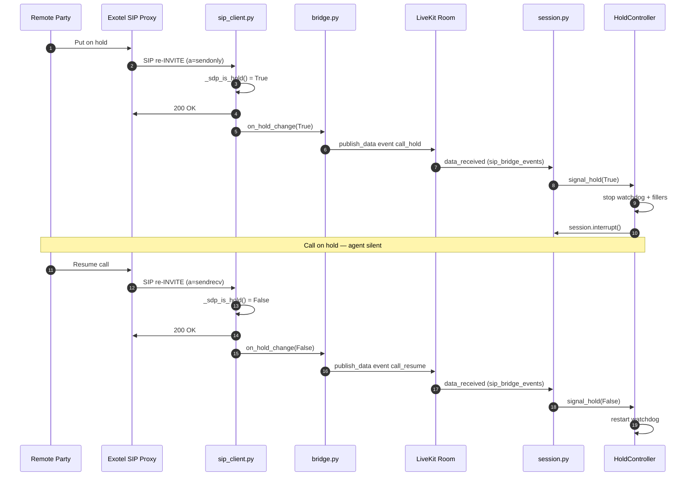
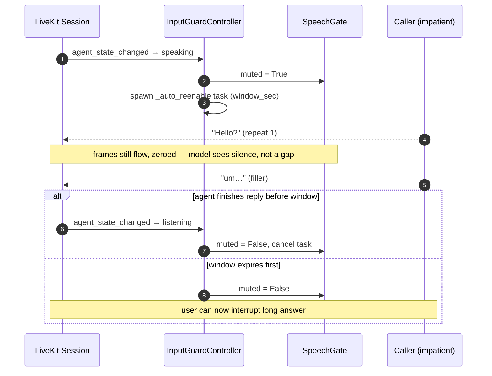

# Audio Pipeline

How phone audio is decoded, filtered, resampled, and pushed to the AI agent — and how agent audio is returned to the PSTN cleanly. Plus the hold/resume detector and the per-utterance input guard that prevent the "Hello? Hello?" fragment loop.

## Inbound RTP Audio Processing

Phone audio from PSTN arrives as **G.711 at 8 kHz**, narrow-band (300–3400 Hz). Feeding it raw to the STT model caused hallucinations — random scripts (Urdu, Hebrew) appearing in transcripts instead of the actual speech. The root causes were:

| Problem | Effect on STT |
|---------|---------------|
| `audioop.ratecv` linear interpolation (8 kHz → 48 kHz) | Creates aliasing harmonics every 8 kHz. STT sees a spectrally wrong signal and hallucinates. |
| Fixed 3× gain applied before resampling | Clips loud phone speech → heavy distortion → hallucination |
| No frequency filtering | DC offset + sub-bass hum from phone acoustics reaches STT as if it were speech |
| Bandpass upper cutoff at 3400 Hz (prior approach) | Redundant — `resample_poly` already low-passes at 4 kHz. The 4th-order IIR phase distortion near cutoffs made voices sound hollow/metallic. |
| `np.clip` hard-clipping after gain | Chops sample peaks → harmonic distortion → STT confused on loud speakers |
| Non-G.711 RTP payloads (PT=101 DTMF / RFC 2833) decoded blindly | Garbage PCM fed into the LiveKit pipeline → STT pollution |

The inbound decode pipeline in `rtp_bridge.py::_decode_rtp_payload` now processes each G.711 packet as follows:

```
RTP packet
    ↓  early-return if payload type is not PCMA (8) or PCMU (0)
    ↓  audioop.alaw2lin / ulaw2lin
raw PCM int16 at 8 kHz
    ↓  Butterworth high-pass (80 Hz, order 2, stateful sosfilt zi)
DC offset and sub-bass hum removed; full speech band preserved
    ↓  scipy.signal.resample_poly(samples, up=6, down=1)
PCM at 48 kHz — polyphase FIR handles low-pass anti-aliasing at 4 kHz
    ↓  np.tanh(samples × 1.5)
quiet phone speech boosted; peaks soft-clipped (no harmonic distortion)
    ↓
final PCM int16 at 48 kHz → LiveKit AudioSource → STT
```

**Why 80 Hz high-pass only (not bandpass)?** Male voice fundamental frequency is 80–150 Hz. The original 300 Hz lower cutoff was silently stripping the root pitch of male voices, leaving only harmonics — audible as a hollow "telephone" sound. The 3400 Hz upper cutoff is redundant because `resample_poly`'s internal Kaiser-windowed FIR already band-limits at 4 kHz (Nyquist of 8 kHz input). A 4th-order Butterworth bandpass also introduces non-linear group delay at both cutoff edges, smearing consonants in time. The 2nd-order high-pass at 80 Hz has minimal phase distortion and only removes content that is never speech.

**Why stateful filter (`sosfilt zi`)?** The IIR filter carries its state (`zi`) across consecutive RTP packets. Without this, the filter restarts with zero initial conditions on each 20ms packet, producing a transient click at every packet boundary — audible as 50 Hz buzz on the STT side.

**Why `resample_poly` over `audioop.ratecv`?** `ratecv` uses linear interpolation, which for a 6:1 upsample creates images of the 8 kHz signal at multiples of 8 kHz throughout the 48 kHz spectrum. `resample_poly` uses a polyphase Kaiser-windowed FIR to reconstruct the correct band-limited signal before upsampling — the output looks like true 48 kHz narrowband audio.

**Why `tanh` soft-clip instead of `np.clip`?** Hard clipping at ±1.0 chops peaks into square-wave-like edges, generating high-frequency harmonics that STT models interpret as fricative consonants. `tanh` rounds peaks smoothly, behaving as an analog-style soft limiter: quiet speech (under ~0.5) passes near-linearly, loud peaks compress without harmonic spray.

**Why no noise suppression in `rtp_bridge.py`?** An earlier experiment ran `webrtc_noise_gain.AudioProcessor` (Google's WebRTC NS) on inbound audio. It was removed because:

1. OpenAI Realtime's `gpt-realtime` model accepts an `input_audio_noise_reduction` setting that runs NS **inside the model**, trained on raw G.711 phone audio.
2. Pre-processing with WebRTC NS shifted the spectral signature OpenAI's `far_field` mode expects → STT accuracy degraded.
3. With AGC enabled, WebRTC AGC amplified the residual echo of the agent's own voice back into the room, triggering OpenAI's VAD as a false barge-in → the agent kept cutting itself off mid-sentence.

That revert stands: the bridge still does only minimal, spectrum-preserving cleanup (DC removal, gain, soft-clip, resampling). Noise suppression now lives one layer downstream, in the agent process, where a single implementation covers phone **and** web calls — see *Input Speech Gate* below.

## Input Speech Gate

Background noise was cutting the agent off mid-sentence on both web and Exotel calls, and none of the LiveKit-side interruption settings could stop it. Two reasons, both structural:

| Constraint | Consequence |
|---|---|
| Self-hosted LiveKit (not Cloud) | Cloud enhanced noise cancellation (BVC/Krisp) is unavailable, and `agent_activity.py` skips adaptive interruption entirely when the worker is not Cloud-hosted. |
| `turn_detection="realtime_llm"` | `on_vad_inference_done` returns early, so VAD-based interruption never runs. `"adaptive"` interruption additionally requires a streaming `stt=`, a `vad=`, and a non-realtime LLM — none present. |
| `_on_input_speech_started` | Calls `interrupt()` **unconditionally** when the realtime model's own VAD reports speech-start. No threshold, no minimum duration. |

Net effect: the realtime model's VAD was the sole barge-in decision-maker, and the `interruption={"min_duration": 2.5, "min_words": 0, ...}` block that was supposed to filter noise never executed. Those keys have been removed from `session.py` rather than left in place looking functional.

The fix is a filter *upstream* of that VAD. `AudioInputOptions.noise_cancellation` accepts a `rtc.FrameProcessor` alongside the Cloud-only `NoiseCancellationOptions`, and a FrameProcessor runs in-process inside `rtc.AudioStream` — neither Cloud-gated nor bypassed by `realtime_llm`. `SpeechGate` (`src/core/agents/audio_denoise.py`) occupies that hook:

```
caller audio (mono, whatever rate RoomIO delivers — 24 kHz by default)
    ↓  rtc.AudioProcessingModule(noise_suppression, high_pass_filter)
around -11 dB on stationary noise; AGC and AEC deliberately off
    ↓  rtc.AudioResampler → 16 kHz COPY, for the VAD only
the frame the model receives keeps its original rate; nothing is downsampled away
    ↓  Silero VAD v5 (ONNX, CPU, 512-sample windows + 64-sample context)
per-frame speech decision, 600 ms hangover
    ↓  non-speech frames zeroed
realtime model hears silence during noise → cannot fire speech-start → cannot interrupt
```

**Why a speech gate and not just a denoiser?** A denoiser lowers the noise *level*; the model's VAD still fires on the residual. Only a speech/non-speech classifier can decide that audio is not the caller talking. The WebRTC NS stage is there to clean what does pass through, not to make the barge-in decision.

**Why AGC stays off.** `AudioInputOptions.auto_gain_control` defaults to `True`, and it was silently active because `session.py` passed `audio_input=True` as a bare bool. That is the same AGC that reason 3 above blames for echo-driven false barge-ins. It is now explicitly `False`.

**Silero's context window.** Each inference must be fed `context + window` samples (64 + 512 at 16 kHz), where the context is the tail of the previous window. Feeding a bare 512-sample window returns ~0.0 for *every* input — including clear speech — and raises nothing, because the ONNX graph declares a dynamic input shape. `tests/test_audio_denoise.py` covers both directions specifically to catch that silent failure.

**Measured behaviour** (33 s telephone-band speech, `assets/audio/*_48k.wav` for noise):

| Input | Speech energy kept | Frames passed |
|---|---|---|
| Telephone-band speech | 94.6% | 79% (the gap is the silence between sentences) |
| Speech mixed with office ambience | 88.0% | 88% |
| Office ambience alone | — | 18% (this fixture contains real background voices) |
| Keyboard typing | — | 0% |
| White noise | — | 0% |

Verified at 16 / 24 / 48 kHz input: the VAD's decisions are identical across all three (79% of speech frames pass at every rate), because it always sees the same 16 kHz resampled copy.

**Latency.** Under 2 ms per 50 ms frame (NS ~0.1 ms, Silero ~1 ms per 32 ms window), roughly 1 core-% per concurrent stream. No buffering and no lookahead, so nothing is added to round-trip time. The cost is that a speech onset is detected within one frame rather than instantly; the gate opens for the whole frame if *any* window in it reads as speech, which recovers the onset.

**What it does not fix.** A television, or a second person talking in the room, is speech. No denoiser and no VAD separates it from the caller — that needs speaker identification.

**Coverage.** `SpeechGate` is applied twice, with a separate instance each time because both the APM and the VAD are stateful per stream: once on the session's audio input (`session.py`), and once inside the Sarvam parallel STT tap (`stt/sarvam_parallel.py`), which opens its own `AudioStream` and would otherwise transcribe raw noise. That same `AudioStream` is where the tap measures the audio it reports as usage. Gated frames are still counted: `SpeechGate` zeroes samples in place and returns the same frame, so the audio is sent to Sarvam as silence rather than dropped.

**Why `_process` guards against being called twice on the same frame.** RoomIO hands the *same* instance to the SDK at two points — as the input stream's `processor` (`voice/room_io/_input.py`, `_apply_audio_processor`) and as the `AudioStream`'s `noise_cancellation` (`rtc/audio_stream.py`). Without a guard every frame on the session's audio input was processed twice, and that is not merely wasted work: the first pass zeroes non-speech samples, then the second pass runs the VAD over those zeros, scores them as silence, and decrements the hangover *again*. The configured 600 ms behaved as 300 ms, so the model's own VAD endpointed mid-sentence and split user utterances. `SpeechGate` now holds a reference to the last frame it saw and returns it untouched on a repeat — a strong reference rather than `id()`, so a freed frame's address cannot alias the next one. The Sarvam tap builds its own `AudioStream` and was always applied once, which is why this showed up as a native-STT problem. Pinned by `test_hangover_is_unaffected_by_the_sdks_double_application`.

**Calibration** — `_THRESHOLD` (0.5), `_HANGOVER_MS` (600), `_ATTENUATION` (0.0, hard gate) at the top of `audio_denoise.py`. Lower the threshold if quiet callers get clipped; raise it if noise still reaches the model. `_HANGOVER_MS` multiplies the cost of every false positive — one bad window holds the gate open that long.

## Outbound RTP Audio Processing

Agent / TTS audio leaves LiveKit at 48 kHz and must be encoded to G.711 (8 kHz) for the PSTN. The outbound pipeline in `rtp_bridge.py::_send_frame`:

```
LiveKit AudioFrame (int16 PCM @ 48 kHz)
    ↓  np.tanh(samples × 0.7)
TTS soft-limited so loud peaks don't clip on the narrow-band SIP path
    ↓  scipy.signal.resample_poly(samples, up=1, down=6)
48 kHz → 8 kHz with built-in anti-aliasing FIR (no metallic artifacts)
    ↓  accumulate to 20 ms (320 bytes) per ptime=20 SDP
    ↓  audioop.lin2alaw / lin2ulaw
G.711 PCMA/PCMU payload (160 bytes)
    ↓  prepend RTP header, sendto(remote_addr)
RTP packet → Exotel → mobile phone
```

**Why `tanh × 0.7` on outbound?** TTS engines (OpenAI, ElevenLabs, Sarvam) normalise output close to 0 dBFS. Pumping that into G.711 causes companding-curve distortion at the loud edges and excessive perceived loudness vs. a normal phone call. The 0.7 scale leaves ~3 dB of headroom; `tanh` softly rounds anything that still approaches the rails.

**Why `resample_poly` instead of `audioop.ratecv` (downsample)?** Same reason as inbound: linear interpolation has no anti-aliasing — any TTS energy above 4 kHz folds back into the audible band as a metallic hiss on the caller's phone. Polyphase FIR low-passes at 4 kHz before decimation, so the caller hears a clean band-limited voice instead of an aliased one.

## STT Noise-Reduction Branching

`noise_reduction_for()` in `src/core/agents/stt/native_prompt.py` picks `input_audio_noise_reduction` from the call origin. It applies to **every** OpenAI branch — half-cascade and full realtime alike. Full realtime used to pass neither this setting nor a transcription prompt, so it ran on the `gpt-4o-mini-transcribe` default with no instructions and no phone tuning. The model is still mini on both branches: what was missing was the prompt and `far_field`, and mini accepts both, so the fix costs nothing per minute.

| Call type | `input_audio_noise_reduction` | Rationale |
|-----------|-------------------------------|-----------|
| Web (`call_type == "web"`) | `near_field` | Browser mic is close to the speaker; default WebRTC-style NS profile applies. |
| Phone (Exotel SIP, all non-web `call_type`) | `far_field` | OpenAI's far-field model is trained on lossy PSTN / G.711 audio. Using `near_field` on phone calls degraded transcription. |

`build_native_stt_prompt()` in the same module prepends a matching note to the STT prompt on phone calls ("Audio is from a live telephone call (G.711 narrowband, ~8 kHz, lossy). Expect static, line hum, codec artifacts...") so the transcription model is aware of the channel and refuses to fabricate words on unintelligible audio. Gemini accepts no transcription prompt, so neither applies there — see [Native Transcription](runtime-modes.md#native-transcription).

**Dependencies:** `scipy>=1.13.0`, `numpy>=1.26.0`, `onnxruntime>=1.20.0` (Silero VAD). `webrtc-noise-gain` has been dropped — the WebRTC NS now comes from `rtc.AudioProcessingModule`, part of `livekit-rtc`. The Silero model is vendored at `src/core/agents/models/silero_vad.onnx` (2.2 MB, MIT) and ships via `COPY src` in every image.

!!! warning "`docker/requirements-agent.txt` pins deps separately"
    The agent container installs from `docker/requirements-agent.txt`, not `pyproject.toml`, and it does not carry the `turn-detector` extra that otherwise pulls in `onnxruntime`. `onnxruntime` is therefore listed explicitly there. Adding a runtime dependency to `pyproject.toml` alone will `ImportError` in production.

## Hold & Resume Detection

When a party puts the call on hold, the platform detects it and suppresses all agent activity to prevent the agent from responding to hold music.

**Exotel (SIP re-INVITE — instant):**

1. Remote party sends a SIP re-INVITE with `a=sendonly` or `a=inactive` in the SDP body.
2. `sip_client.py` parses the SDP, detects the hold attribute, sends `200 OK`, and fires the `on_hold_change` callback.
3. `bridge.py` publishes a data packet (`{"event": "call_hold"}` or `{"event": "call_resume"}`) to the LiveKit room on topic `sip_bridge_events`.
4. `session.py` receives the event and activates `HoldController`, which:
   - Stops `SilenceWatchdogController` (no reprompts during hold)
   - Stops `FillerController` (no backchannel fillers during hold)
   - Calls `session.interrupt()` to kill any in-progress agent speech
5. On resume, the silence watchdog is restarted and normal agent behavior resumes.



**Suppression during hold:**

Three event handlers check `hold_controller.is_on_hold` and suppress activity:

| Event | Behavior during hold |
| :--- | :--- |
| `conversation_item_added` | Interrupts assistant speech; assistant transcript dropped. **Caller transcripts are still saved** — see `should_record` in `session.py`. No filler-context or silence-watchdog side effects. |
| `user_state_changed` | Returns early; no filler/silence watchdog triggers |
| `agent_state_changed` | Calls `session.interrupt()` if agent starts speaking |

!!! note "Provider coverage"
    Hold detection via SIP re-INVITE works for **Exotel** calls only. Twilio and other providers do not currently have hold detection — the agent may respond to hold music if the call is placed on hold for extended periods.

## Per-Utterance Input Guard

Phone callers frequently repeat themselves while the agent is producing its reply ("Hello… Hello?"). Each repeat is a legitimate ≥0.9 s word, so no duration-based filter would help even if one ran — and under `turn_detection="realtime_llm"` none does, as described above. The framework correctly classifies the repeat as a barge-in, the agent fragments its current sentence, the LLM generates an apology, and the cycle repeats. Observed in production as the "Sorry, I'm here / Yes, I'm…" loop.

The same gate cannot filter **filler sounds** either. "um" / "uh" / "hmm" is 200–400 ms of voiced speech, and Silero correctly identifies it as speech. Measured against a real voiced burst: on a quiet line, bursts under ~400 ms are rejected (an accident of the noise suppressor's adaptation, not a feature); over office ambience, even a 200 ms burst passes. So filler-word barge-in is the input guard's job, not the gate's.

`InputGuardController` (`src/core/agents/voice_features.py`) closes both loops by blanking user audio for the first N seconds of every agent utterance.

**Why it mutes rather than detaches.** It sets `SpeechGate.muted = True`, which zeroes every frame while leaving the stream flowing. It previously called `session.input.set_audio_enabled(False)`, which detaches the input — and `_ParticipantInputStream._forward_task` then **drops frames outright** (`if not self._attached: continue`). A realtime model that expects a continuous audio feed can misbehave on that gap, which is why realtime mode used to be excluded from the guard entirely. Muting has no such hazard, so the guard now runs in **both** realtime and pipeline modes. Cost of the change: the model is billed for the silent audio that a detached stream would not have sent.

**Lifecycle (per agent reply):**

| Event | Action |
|---|---|
| Agent state → `"speaking"` | `gate.muted = True` + schedule unmute task (window = `input_guard_window_sec`, default 3.0 s) |
| Agent state leaves `"speaking"` before window expires | Cancel task, unmute immediately (don't make user wait when agent finished early) |
| Window expires while still speaking | Unmute anyway — user can interrupt long answers after the dead-time |
| Call teardown (`_flush_and_end_call`) | `aclose()` cancels task + force-unmutes |

`input_guard_window_sec` is a real field on `assistant_interaction_config` (default `3.0`, range 0–10, settable via `/assistant/create` and `/assistant/update`). Raise it to reject more filler words; the caller also cannot genuinely interrupt within the window, so it is a direct trade. `0` disables the guard — the controller is not constructed at all.



**Active in every mode that has audio.** Constructor guard at `session.py`:

```python
speech_gate = None if is_text_only else SpeechGate()
...
_guard_window = interaction_config.input_guard_window_sec
input_guard = None if (speech_gate is None or _guard_window <= 0) else InputGuardController(
    logger=logger,
    gate=speech_gate,
    window_sec=_guard_window,
)
```

Realtime mode is no longer excluded. The exclusion existed because Gemini full-realtime (`assistant_mode="realtime"`, `provider="gemini"`) owns its own audio pipeline and internal VAD, and detaching the input source cut the feed it relies on. Muting through `SpeechGate` keeps the feed continuous, so the hazard is gone and realtime calls get the same filler-word protection. Text-only chats have no audio input, so `speech_gate` is `None` and no guard is built.

!!! note "Verify on a Gemini realtime call"
    Muting is safe in principle — frames keep arriving at the same rate, carrying silence — but the original exclusion was written against observed Gemini behaviour. Worth one realtime-mode call to confirm Gemini Live tolerates a 3 s silent stretch mid-session before relying on it in production.

**Interaction with the first-utterance VAD disable.** The existing greeting path (`session.py` lines 636–688) sets `llm._opts.turn_detection = None` for the full duration of `session.generate_reply()` when `allow_interruptions=False`. That VAD-level block fully covers the greeting end-to-end. `InputGuardController` *also* fires on the greeting (3 s source mute on top), but its window is redundant during the greeting because the VAD is already off. Subsequent replies, where the greeting code does not run, are the ones the guard actually protects.

**Trade-off.** Users cannot interrupt the agent in the first 3 s of any reply. Acceptable for phone UX: human callers rarely interrupt within sub-second of the agent starting to speak, and short replies (e.g., "Sure, one moment.") typically end before the window expires, at which point `on_speaking_end` re-enables audio immediately.
