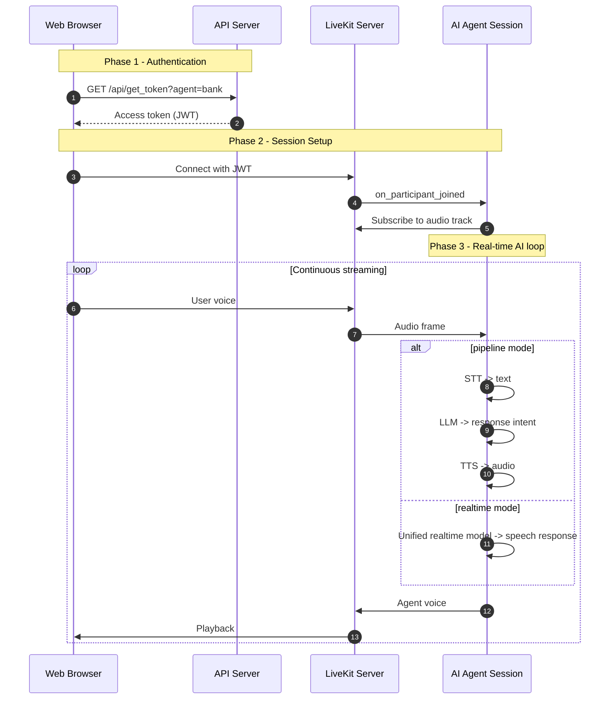
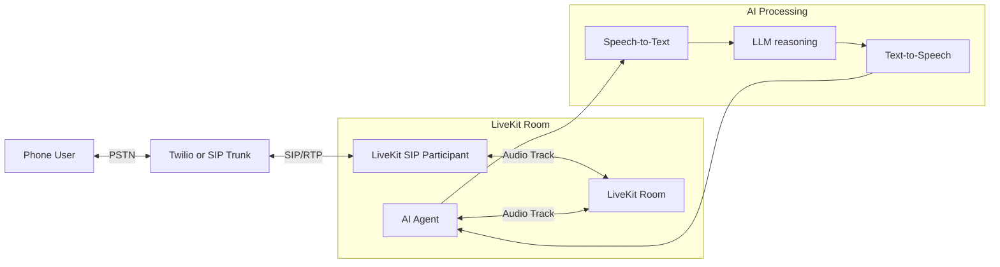
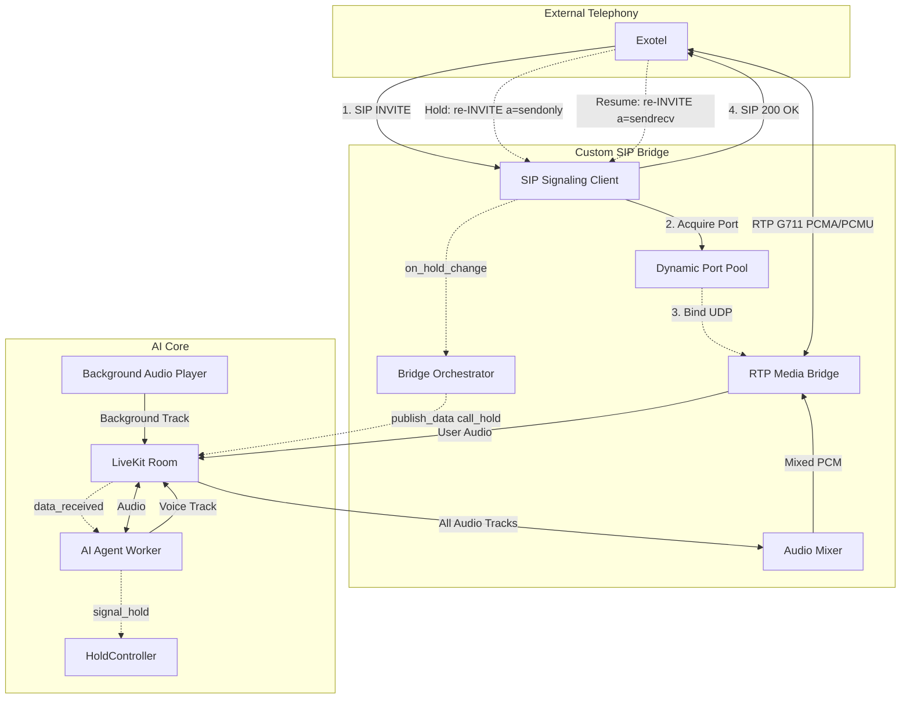
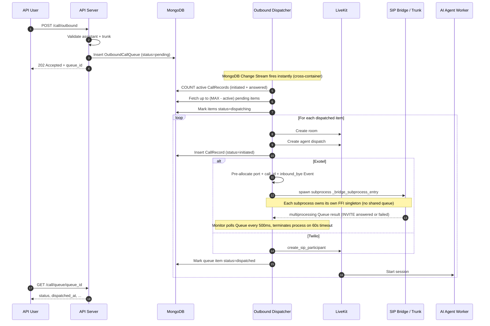
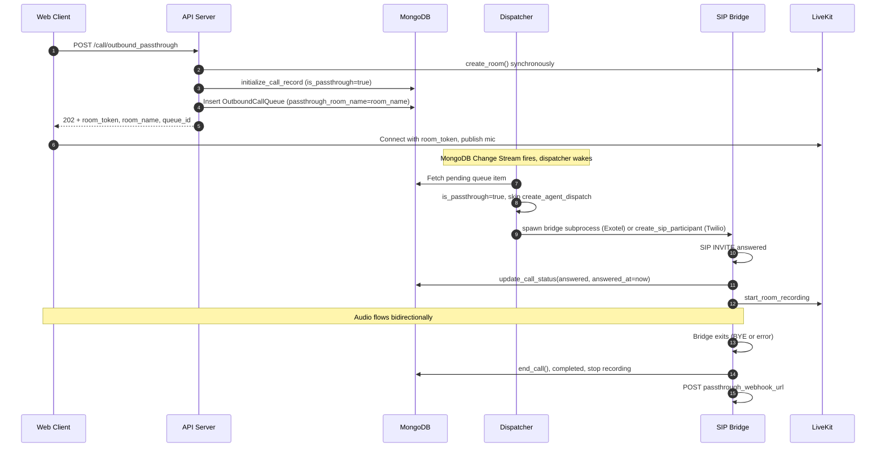

# Call Flows & Queueing

How web calls connect, how managed-SIP (Twilio) and custom-SIP (Exotel) calls bridge, how the outbound queue paces dispatch, and how passthrough reuses the same infrastructure without an AI agent.

## Web Integration

This flow shows how a web client authenticates, joins LiveKit, and exchanges audio with an AI agent session.



## Managed SIP Integration

This is the standard LiveKit SIP participant flow for providers such as Twilio.



## Custom SIP Reach (Exotel)

For Exotel custom SIP reach, a dedicated bridge handles SIP signaling, RTP relay, and LiveKit room connectivity.

### Bridge Concurrency Model

#### v1 — Thread-per-bridge (historical)

Each concurrent call ran in its own OS thread with a dedicated `asyncio.run()` event loop. This isolated asyncio scheduling across calls but did **not** isolate the native audio queue.

The LiveKit Python SDK uses a process-wide Rust FFI singleton (`livekit-ffi`) with a single internal frame queue. All `rtc.AudioStream` objects in all threads competed for the same native queue. Under load (>5–8 concurrent calls), the queue saturated, causing:

- `native audio stream queue overflow; dropped N queued frames` warnings
- `signal client closed: "ping timeout"` reconnect cycles
- `signal_event taking too much time` stalls
- `Bridge task cancelled after timeout` / `TX=0` on outbound calls

```
FastAPI process (single PID)
├── Thread: bridge-out-A  → rtc.AudioStream ──┐
├── Thread: bridge-out-B  → rtc.AudioStream ──┤── shared FFI queue ← OVERFLOW at scale
└── Thread: bridge-out-C  → rtc.AudioStream ──┘
```

#### v2 — Process-per-bridge, outbound only (historical)

Each outbound bridge moved into its own **OS process**, spawned with `multiprocessing.get_context("spawn")`. Each process loads its own copy of the Rust FFI shared library — a completely separate native queue with no contention.

Inbound bridges were left on `threading.Thread`, on the assumption that inbound volume stayed around 1–5 simultaneous calls and would never reach the pressure that broke outbound.

#### v3 — Process-per-bridge for inbound too, on a forkserver (current)

That assumption stopped holding at 12–14 concurrent inbound calls, and the failure looked exactly like the outbound one had: the agent's audio never reached the caller, while the LiveKit-side recording (server egress) still captured both sides perfectly. A call that sounded correct in S3 and silent on the phone.

The mechanism is the same shared FFI singleton described above, plus one detail specific to the inbound direction: `AudioSource.capture_frame` subscribes a **fresh, unfiltered** queue to the global FFI event queue for every frame, and the inbound bridge calls it once per RTP packet — 50 per second per call. `FfiQueue.put` then walks every subscriber under a single lock on a single thread, so the cost of each event grew with the number of calls in the process.

Inbound bridges now run one process per call, in `inbound_worker.py`.

```
SIP dispatcher process (PID 1234)
├── Process: bridge-out-A (PID 1235) → rtc.AudioStream → own FFI queue ✓
├── Process: bridge-in-B  (PID 1236) → rtc.AudioStream → own FFI queue ✓
└── Process: bridge-in-C  (PID 1237) → rtc.AudioStream → own FFI queue ✓
```

**Why `forkserver` and not `spawn`**: `spawn` re-imports the whole scientific stack in every child, and `scipy.signal` alone costs several seconds of CPU per import. At a dozen simultaneous calls that was a large burst of pure import work on a small host — it starved the dispatcher's event loop and spiked host CPU. `forkserver` pays that cost once in a server process and forks each bridge from it warm. Measured on 8 concurrent bridges: startup dropped from ~1.45 s to ~0.68 s each, and total resident memory from 869 MiB to 605 MiB, because the preloaded pages are shared copy-on-write.

`get_bridge_context()` in `src/services/outbound_dispatcher/dispatcher.py` owns this, and falls back to `spawn` if `forkserver` is unavailable.

**What is preloaded, and what deliberately is not**: the preload list is `numpy`, `scipy.signal`, `audioop`. It excludes `livekit.rtc` — importing it starts the native FFI callback thread, and forking a process that has live native threads leaves children with a broken FFI. Each bridge imports it itself, after the fork.

**Forking is still not done from the event loop**: `forkserver` forks from a clean helper process, not from the dispatcher, so there is no inherited asyncio state. All arguments must still be picklable.

**Every multiprocessing object must come from the same context.** A `multiprocessing.Event()` built from the default context and handed to a `forkserver` child fails outright with *"A SemLock created in a fork context is being shared with a process in a spawn context."* `register_call_id` therefore builds its Event from `get_bridge_context()`.

#### Inbound answer ordering — ring until the agent is ready

Inbound calls used to be answered as soon as the media bridge was up. Everything the agent still had to do — the inbound-context webhook (up to 10s), tool loading, `session.start()` — then played out as dead air on the caller's phone. Outbound never had this problem, because the agent boots while the phone rings. Inbound now has the same shape:

1. **`100 Trying`** immediately on INVITE. Setup involves DB lookups, room creation, dispatch and a process start; before this, Exotel saw no response at all for that whole window.
2. The bridge process starts, binds its RTP socket and joins the room, then reports **`media_ready`** on a `multiprocessing.Queue`. Exotel starts sending RTP the moment it sees a 200 OK, so answering before the socket exists would point it at a port nothing is listening on.
3. **`180 Ringing`** goes out and the caller hears ringing.
4. The agent publishes **`agent_ready`** on the `sip_bridge_events` data topic once `session.start()` returns — which is after the inbound-context webhook has already answered. The bridge process relays it to the parent as a second queue event.
5. **`200 OK`** on `agent_ready`, or after `INBOUND_MAX_RING_SECONDS` (default 15), whichever comes first. **A slow agent delays the answer; it never drops the call.**

The agent-side signal is advisory. If it never arrives — an older agent build, or a failed publish — the bridge falls back to the agent's audio track being subscribed, and then to the ring deadline. Set `INBOUND_RING_UNTIL_AGENT_READY=false` to answer on `media_ready` as before.

**The To-tag is minted once**, before the 180, and reused by the 200 OK and by any later rejection in that transaction. A 1xx with a To-tag opens an early dialog and the 2xx has to confirm *that* dialog; two different tags read as two dialogs, and ACK routing and CANCEL matching come apart.

**The 180 is deliberately unreliable** — no `Require: 100rel`, no `RSeq`. Nothing in this codebase handles PRACK (the listener dispatches only BYE, CANCEL, OPTIONS, INVITE and ACK), so a reliable provisional would leave Exotel retransmitting a PRACK forever.

**Cancellation is checked throughout the ring.** A caller who hangs up while ringing gets `487 Request Terminated`. Previously there was no check between the last setup checkpoint and the 200 OK, so a CANCEL arriving in that window was recorded and ignored and the call was answered anyway.

Once the 200 OK is sent, `handle_inbound_call` arms the silent-agent watchdog and hands the process to a monitor task, then returns — so a call does not occupy an INVITE setup slot for its whole duration. The watchdog is armed *after* the answer on purpose: it force-ends a call whose agent never arrives, counting from the answer, and arming it earlier meant its grace period ran during the ring and killed healthy calls.



### Outbound Exotel Lifecycle

- `POST /call/outbound` validates the request, inserts to `outbound_call_queue`, and returns `202 Accepted` with a `queue_id`. No LiveKit room is created at this point.
- The event-driven dispatcher wakes immediately on enqueue and creates the LiveKit room + starts the SIP bridge when a capacity slot is available.
- Before spawning the bridge subprocess, the dispatcher pre-allocates three resources in the parent process:
    - **RTP port** — acquired from `PortPool`; subprocess uses the number directly; parent monitor releases it on exit.
    - **`call_id`** — UUID pre-generated so the parent can register the inbound BYE event before the subprocess starts.
    - **`inbound_bye` event** — `multiprocessing.synchronize.Event` (OS shared memory); registered with the inbound SIP listener in the parent; subprocess polls it to detect BYE arriving on a new TCP connection.
- SIP setup outcome (`200 OK` / failure / timeout) is resolved out-of-band via a `multiprocessing.Queue` written by the bridge subprocess and polled every 500 ms by the dispatcher's monitor coroutine; the caller can poll `GET /call/queue/{queue_id}` for status.

    !!! note "Historical: thread-based IPC"
        In v1 (thread-per-bridge), a `concurrent.futures.Future` was shared in-memory between the bridge thread and the monitor task. The monitor used `asyncio.wrap_future()` to await it. This worked because threads share the same process address space. With subprocess isolation, `Future` cannot cross process boundaries; `multiprocessing.Queue` is used instead — for inbound as well as outbound.

- On SIP setup timeout, the dispatcher calls `bridge_process.terminate()` (SIGTERM). The parent monitor's `finally` block always releases the pre-allocated port and unregisters the `call_id` regardless of how the subprocess exits.
- Agent speech and recording are gated by bridge `call_answered` signaling to avoid recording before answer. The agent's listener for this data-channel event is registered in `session.py` before `session.start()` runs, not after — `session.start()` can itself take several seconds (tool loading, TTS prewarm, the inbound-context webhook), and a data-channel event has no buffering or replay, so registering the listener any later left a window where an answer arriving mid-boot was silently missed.
- After readiness is confirmed, start-instruction delivery applies to both runtime modes (`pipeline` and `realtime`), following a bounded wait/recorder/warmup sequence (see `docs/api/calls/flow.md#exotel-runtime-gating`) that is raced against the callee hanging up, so a call that ends right after answer doesn't leave the agent process blocking on a stale wait.
- Terminal status finalization and webhook emission are handled through a single lifecycle path to reduce duplicate or conflicting terminal updates.
- If SIP returns `200 OK` but no RTP ever arrives (`no_rtp_after_answer`), lifecycle final status is treated as `failed`.

## Outbound Queueing and Capacity Control

All outbound calls go through a persistent MongoDB queue before being dispatched to LiveKit. This prevents server overload when users trigger many calls simultaneously.

### Outbound Call Flow



### Queue States

| State | Meaning |
| :--- | :--- |
| `pending` | Waiting for a free slot |
| `dispatching` | Slot reserved — room creation in progress |
| `dispatched` | LiveKit room created and SIP bridge started |
| `failed` | All retry attempts exhausted |

### Capacity Model

Capacity is calculated as:

```
available_slots = MAX_CONCURRENT_JOBS(12 default) - active_sessions

active_sessions = COUNT(CallRecord where status IN ["initiated","answered"])
                + _dispatching_count  ← in-memory reservation for mid-dispatch calls
```

### Caps are per call type

The four call types cost very different amounts. A phone call needs an agent job process, a
bridge process and an RTP port; a web call needs only the agent job; a `text_only` web call has
no TTS, STT or VAD at all. One shared counter therefore let a burst of web sessions give phone
callers a busy tone.

| Setting | Default | Governs |
|---|---|---|
| `MAX_CONCURRENT_JOBS` | `12` | telephony: inbound, outbound, passthrough |
| `MAX_CONCURRENT_WEB_CALLS` | `40` | web calls |
| `MAX_CONCURRENT_SESSIONS` | `48` | hard ceiling across every type |
| `MAX_CONCURRENT_INVITE_SETUPS` | `24` | inbound INVITEs in setup at once |

Buckets come from `CallRecord.call_type`: `web` is its own bucket, everything else is telephony.
Passthrough is not a `call_type` — it is a boolean on an `outbound` row — so it lands in
telephony, which is correct: it holds a bridge process and an RTP port. Rows with no `call_type`
(legacy) count as telephony, the safe direction to be wrong in.

`MAX_CONCURRENT_INVITE_SETUPS` is **not** a cap on live inbound calls — the setup slot is
released as soon as the call is answered. It has to exceed the number of calls that can be
ringing simultaneously, because the ring-until-agent-ready wait happens inside it.

The count is one aggregation grouped by `call_type`, served by the `(call_status, call_type)`
index on `call_records`. Before that index it was a full collection scan on every inbound INVITE
and every web-call request, growing with total call history rather than with the number of calls
actually in progress.

!!! warning "The web and global defaults are provisional"
    They are not derived from a measured agent-session footprint. The only figure available is a
    ~238 MiB import floor per agent job process, before audio buffers, model state and provider
    connections. Run a load test, read the agent container's steady-state RSS per session with
    `docker stats`, and record the number here.

The `_dispatching_count` in-memory counter bridges the gap between "room creation started" and "CallRecord written to MongoDB" (~100ms window), preventing double-dispatch under any timing.

`try_reserve_slot()` holds a lock across its count-and-increment. Without it, the `await` in the middle let concurrent callers all observe the same pre-burst count and all pass — the cap was softest under exactly the burst it exists for. Inbound INVITE setups are additionally bounded by a semaphore (`MAX_CONCURRENT_INVITE_SETUPS`, default 8) so a burst cannot outrun the gate.

Web calls reserve from the pool too. They dispatch a real agent and write a `CallRecord`, but used to skip the cap entirely, so a burst of web sessions could starve the telephony queue without ever being throttled; they now return `503` when the cap is reached.

Inbound calls reserve from the same pool: the inbound bridge calls `try_reserve_slot()` after assistant resolution and rejects with SIP `486 Busy Here` if the cap is reached. RTP port-pool exhaustion also answers `486` — it used to raise out of an unawaited task, leaving the INVITE with no SIP response at all and the caller listening to dead air until Exotel timed out. The reservation is released either after the inbound `CallRecord` is persisted (so subsequent counts come from the DB) or on any failure between reservation and persistence.

### RTP Port Pool

Each concurrent call binds one UDP socket for RTP. Ports come from `PortPool`
(`src/services/exotel/custom_sip_reach/port_pool.py`), which steps by 2 so `port+1` stays free
for RTCP — so a range of N ports supports N/2 concurrent calls.

| Setting | Default | Notes |
|---|---|---|
| `SIP_BRIDGE_PORT_RANGE_START` / `RTP_PORT_START` | `41000` | `SIP_BRIDGE_PORT_RANGE_*` wins if both are set |
| `SIP_BRIDGE_PORT_RANGE_END` / `RTP_PORT_END` | `42000` | 500 concurrent calls at the default |
| `PortPool.COOLDOWN_SECONDS` | `30` | Idle time before a released port may be reused |

!!! warning "The range must be open in the firewall, and must avoid LiveKit's"
    Open the whole range for UDP in your AWS Security Group — the ports are useless if the
    firewall drops them, and the symptom is a call that connects with no audio in either
    direction (`[RTP] ZERO inbound packets` in the logs).

    Keep the range outside LiveKit SIP's `10000-40000` and LiveKit RTC's `50000-60000`. If a
    bridge and a co-hosted LiveKit service bind the same UDP port, audio is delivered to
    whichever bound it last — which presents as one caller hearing another call.

Ports are handed out round-robin with a 30 second cooldown after release. Both matter: the pool
previously returned the lowest free port after only 5 seconds, so the same handful of ports
churned constantly, and RTP still in flight from a call that had just ended could arrive at a
socket already rebound to a new call. The RTP socket also drops any packet whose source does not
match the endpoint negotiated in the SDP, and no longer learns its peer from the first packet it
receives.

### Crash Recovery

Two mechanisms keep the slot pool consistent across crashes:

1. **Server crash → startup cleanup.** On boot, `_fail_stale_calls_on_startup()` runs the orphan reaper: for each `CallRecord` in `initiated`/`answered` it asks whether that call's LiveKit room still exists, and fails only the ones whose room is gone. The in-memory `_dispatching_count` resets to `0` naturally with the new process.

    This used to fail *every* active record unconditionally. That was only safe while the dispatcher owned every live call. In the current split deployment the agent containers outlive a dispatcher restart, so a restart — an OOM restart included — cut every call in progress across the whole platform at once.
2. **Worker crash mid-dispatch → per-tick recovery.** `_recover_stuck_dispatching()` runs on every dispatcher wake and resets outbound queue items left in `dispatching` longer than `STUCK_DISPATCHING_MINUTES` (5 min) back to `pending`, or to `failed` once `MAX_RETRIES` is reached. The cutoff is measured against `dispatched_at`, stamped when the item is claimed — measuring it against `queued_at` meant any call that had waited longer than the cutoff in the queue was treated as stuck the instant it dispatched, and dialled a second time while the first bridge was still ringing. Inbound has no queue item; its slot is freed by the in-process try/except path or by the startup cleanup above.

    Queue items are claimed with a conditional update (`status: "pending"` → `"dispatching"`), not a read followed by `save()`, so two dispatchers — or one dispatcher racing its own stuck-item sweep — cannot both claim the same row.

On the agent worker side, `load_fnc=_worker_load` with `load_threshold=0.9` provides a secondary guard: the worker stops accepting new jobs once it is running 90% of `MAX_CONCURRENT_JOBS`.

It previously used the SDK default, which averages CPU across the whole machine. That coupled agent intake to unrelated load: when the SIP dispatcher spiked CPU launching bridge processes, the worker quietly stopped accepting jobs, calls connected with no agent behind them, and the caller heard nothing. Counting the worker's own jobs keeps the decision local.

### Retry Behaviour

Failed dispatches (SIP error, LiveKit API error, trunk inactive) are retried up to `3` times automatically. The item is reset to `pending` and re-queued on the next dispatcher wake. After 3 failures, status becomes `failed` with the last error stored in `last_error`.

### Event-Driven Design

The dispatcher uses MongoDB Change Streams for cross-container, zero-latency notification:

```
New call enqueued (any container)
    → Change Stream on outbound_call_queue fires instantly
    → dispatcher wakes, processes queue immediately

Call finishes (agent container)
    → Change Stream on call_records (terminal status) fires
    → dispatcher wakes, chains next pending call immediately

No calls for hours
    → dispatcher sleeps (0 CPU)
    → 30s fallback poll as safety net (catches missed events during stream restart)
    → returns to sleep if queue empty

Server restart with pending items in MongoDB
    → startup recovery: _process_pending() runs on boot
    → all pending calls from before restart are dispatched
```

Both Change Stream watchers auto-restart on error with 5s backoff. No new infrastructure needed — MongoDB Atlas always runs replica sets.

### Module Layout

```
src/services/outbound_dispatcher/
├── __init__.py      # re-exports outbound_dispatcher_loop
└── dispatcher.py    # constants, capacity helpers, Change Stream watchers, dispatch logic, loop

src/services/exotel/custom_sip_reach/
├── bridge.py              # run_bridge() coroutine + _bridge_subprocess_entry() (spawn target)
├── inbound_bridge.py      # inbound SIP → LiveKit bridge (thread-per-call, low volume)
├── inbound_listener.py    # TCP SIP listener; BYE/OPTIONS handler; call-id → Event registry
├── rtp_bridge.py          # UDP RTP ↔ LiveKit AudioStream/AudioSource
├── sip_client.py          # SIP INVITE/BYE/auth over TCP
├── port_pool.py           # Thread-safe UDP port allocator (round-robin + cooldown)
├── inbound_worker.py      # One inbound call's media half, in its own process
└── config.py              # Env-var constants
```

**Key IPC boundary (v2):**

| Resource | Owner | How shared |
|---|---|---|
| RTP port number | Parent (PortPool) | Passed as `int` arg to subprocess |
| `call_id` | Parent (pre-generated UUID) | Passed as `str` arg; used in SipClient + inbound listener |
| `inbound_bye` | Parent (registered in listener) | `multiprocessing.synchronize.Event` — OS semaphore, visible across processes |
| SIP result | Subprocess | `multiprocessing.Queue.put()` → parent monitor polls |
| Port release | Parent monitor `finally` | Always runs regardless of subprocess exit reason |

Consumers import from the package root:

```python
from src.services.outbound_dispatcher import outbound_dispatcher_loop # sip_dispatcher_run.py
```

## Passthrough Mode

Passthrough mode reuses the same outbound infrastructure but skips the AI agent entirely. A human web user's mic is bridged directly to the phone caller via SIP.

```
NORMAL AI OUTBOUND:
  Web/SIP ↔ RTP Bridge ↔ LiveKit Room ↔ AI Agent (STT → LLM → TTS)

PASSTHROUGH:
  Web User ↔ LiveKit Room ↔ RTP Bridge ↔ SIP ↔ Mobile
                 ↑
         No AI agent, no STT/LLM/TTS
```

### Key Differences from Normal Outbound

| Aspect | Normal AI Call | Passthrough Call |
| :----- | :------------- | :--------------- |
| Agent dispatch | `create_agent_dispatch()` called | Skipped entirely |
| Room creation | Dispatcher creates room | API endpoint creates room synchronously (web client needs token immediately) |
| Token returned | No token in API response | `room_token` returned in `POST /call/outbound_passthrough` response |
| Recording start | After bridge `call_answered` event in `session.py` | After SIP 200 OK in `_monitor_exotel_result` (Exotel) or after `create_sip_participant` (Twilio) |
| Call finalization | `session.py` calls `end_call()` | Dispatcher monitor calls `end_call()` after bridge exits |
| Transcript | STT produces full transcript | Always empty — no STT runs |
| Webhook trigger | `assistant_end_call_url` on assistant | `passthrough_webhook_url` on trunk |
| Analytics | Appears in all analytics endpoints | Excluded from `by-assistant`; use `GET /call/records?passthrough_only=true` |

### Passthrough Outbound Queue Flow



### Audio Routing in Passthrough

The `rtp_bridge.py` component does not need changes for passthrough. Its `on_track_subscribed` handler generically subscribes to **any** participant's audio track and feeds it into the RTP mixer. When the web user publishes their mic track, the bridge automatically routes it to SIP — exactly the same as it would route an AI agent's audio track.

```
Web user's mic track
      ↓
LiveKit room (web participant)
      ↓
on_track_subscribed (rtp_bridge.py) — same generic handler, no passthrough-specific logic
      ↓
AudioMixer → G.711 RTP → Exotel/Twilio SIP → Mobile phone
```

The mobile phone's audio comes back the same way in reverse, appearing as an audio track from the SIP bridge participant that the web user's LiveKit SDK plays back automatically.

## Provider Support Matrix

| Provider | Inbound | Outbound | Implementation path |
| :--- | :--- | :--- | :--- |
| `exotel` | Supported | Supported | Custom SIP bridge (`custom_sip_reach`) |
| `twilio` | Not implemented yet | Supported | LiveKit managed SIP participant |

!!! note "Current support status"

    Twilio inbound is planned but currently unsupported.
