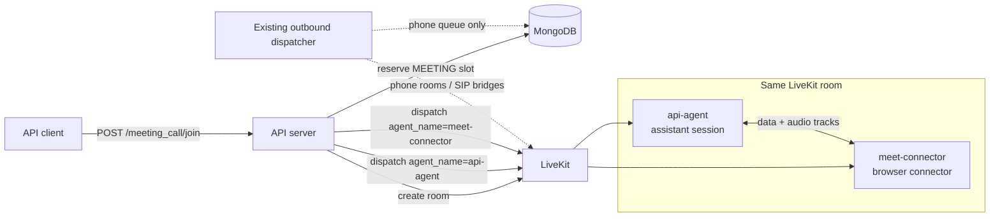
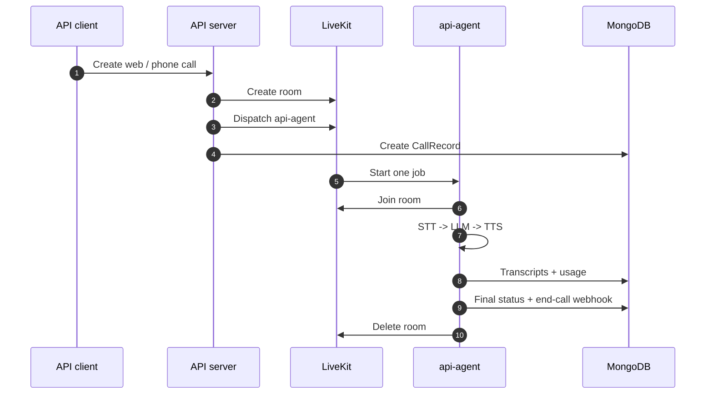
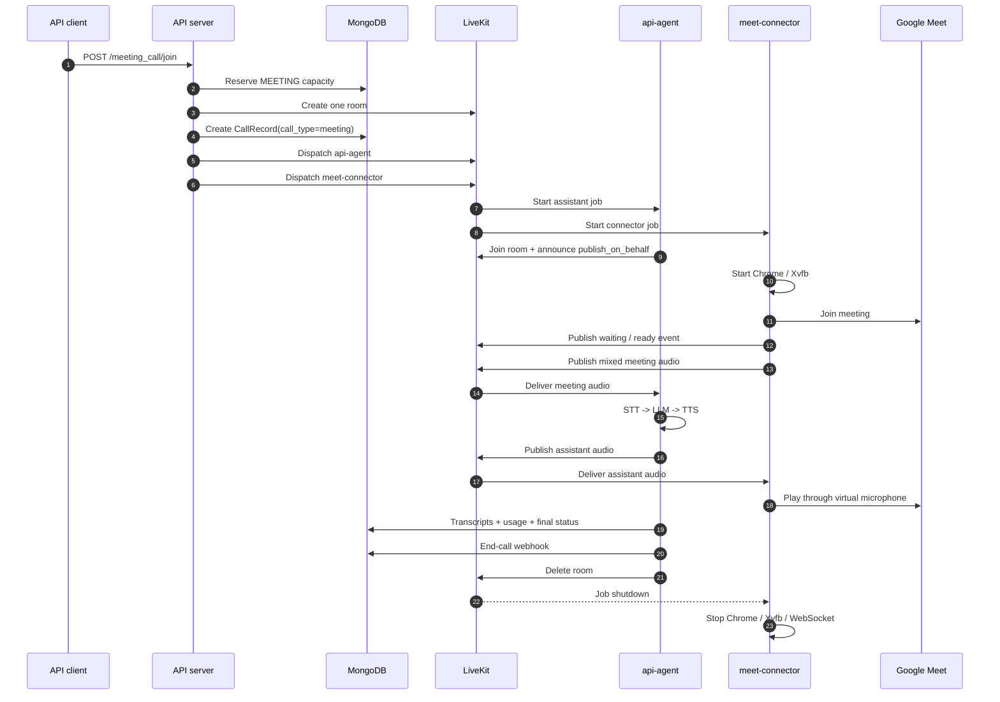
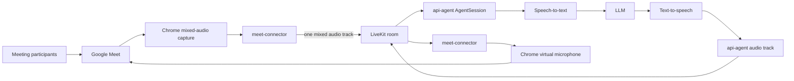

# Google Meet Call Architecture

Google Meet calls use one LiveKit room and two LiveKit jobs. They do **not** create a second
application-level outbound dispatcher.

- The existing **outbound dispatcher** remains the single queue processor for outbound phone calls.
- The `api-agent` LiveKit job runs the assistant conversation and owns call state, recording, usage,
  billing, webhooks, and room teardown.
- The `meet-connector` LiveKit job runs Chrome and acts as the bidirectional Google Meet audio
  bridge.

Normal web, inbound, and outbound assistant calls create only the `api-agent` job. A meeting call
creates both jobs in the same room because the assistant and the browser bridge have different
lifecycles and responsibilities.

## How many workers and participants, by call type

Every call type puts exactly two parties in one LiveKit room. What differs is *what* the second
party is, and whether the platform had to dispatch a second agent job to create it.

| Call type | Agent dispatches | Participants in the room | Who publishes audio | Who subscribes |
|---|---|---|---|---|
| Web | 1 — `api-agent` | Agent job + the browser user | Agent's microphone track; the user's microphone unless `text_only` | Each other |
| **Meeting** | **2 — `api-agent` + `meet-connector`** | Agent job + connector job. **No human is ever in this room**; the humans are in Google Meet | Agent's microphone track; the connector's single `meet-audio-mixed` track | Each other |
| Phone / Twilio | 1 — `api-agent` | Agent job + a LiveKit-native SIP participant | SIP participant carries the caller; agent carries the replies | Each other |
| Phone / Exotel | 1 — `api-agent` | Agent job + a bridge subprocess the API owns, joining as `sip-<number>` | Bridge publishes the caller's RTP as a microphone track; agent carries the replies | Each other |
| Passthrough | **0** | Browser user + SIP participant or Exotel bridge | Both human sides | Each other |

Two things follow from the meeting row, and they are the reason this page exists.

First, a meeting is the only call type that needs **two LiveKit agent dispatches**. The Exotel
bridge plays the same architectural role — a media bridge that terminates a far-end transport and
exposes it as an audio track — but it is a subprocess the API starts directly, not a job LiveKit
schedules. The connector is a job because it needs a whole browser and a machine that can run one,
which is a different capacity and deployment problem from the assistant's.

Second, the assistant never talks to Google Meet, and the connector never talks to a model. Each
one only sees a LiveKit room. That is what keeps the connector replaceable: a connector for Zoom or
Teams is the same contract with a different browser automation behind it. See the
[meeting connector guide](../guides/meeting-connector.md).

## Dispatch topology



`agent_name` is a LiveKit worker routing key. The second dispatch is not a second queue processor,
and `outbound_dispatcher/dispatcher.py` is not duplicated for meetings.

### Normal assistant call



### Google Meet call



## Audio flow

The connector is a media bridge, not a second assistant. It does not run STT, LLM, TTS, usage
accounting, or conversation logic.



### Meeting to assistant

Google Meet audio is mixed before publication. The connector publishes one track containing the
meeting mix rather than one track per speaker. This matches the assistant's one-linked-participant
model, so the assistant hears all meeting participants. The trade-off is that transcripts do not
attribute each sentence to a specific meeting speaker.

Mechanically, the connector's page intercepts every inbound WebRTC audio track Google Meet creates
and sums them into one Web Audio mix. That mix is downmixed to mono, framed, and sent to the
connector's Python process, which publishes it as a single LiveKit track named `meet-audio-mixed`.
The capture is incremental: a participant who joins after the bot was admitted is added to the mix
when their track appears, rather than being missed by a one-time snapshot.

The assistant subscribes to that track like any other input. Meeting calls widen the accepted
participant kinds to include `PARTICIPANT_KIND_AGENT`, because the connector is itself an agent job
— on every other call type the assistant would ignore a participant of that kind.

### Assistant to meeting

The assistant announces itself before it starts its session, by setting an attribute on its own
participant:

```text
lk.publish_on_behalf = <LiveKit room name>
```

The connector uses that attribute to select the assistant's output track. The value is the room
name rather than a participant identity because LiveKit mints the agent's identity inside the job
token: nobody can know it before the agent joins, while the room name is a value both sides already
hold. The attribute is set *before* `session.start()`, because the SDK publishes the microphone
track from its own initialisation task and the connector decides once, when the track is
subscribed.

The connector sums every track it receives from the assistant into one output and plays that into
Chrome's virtual microphone, which Google Meet sees as an ordinary input device.

!!! warning "A connector's browser must subscribe as a visible participant"
    LiveKit does not tell a publisher when a *hidden* participant subscribes to its track. The
    agents SDK waits for that notification before it forwards a single audio frame, so a connector
    whose browser joins hidden leaves the assistant inaudible in the meeting **and** absent from the
    recording, with no transcript, while the model runs and bills for the whole call. The cost of
    joining visibly is one extra participant in the room that publishes nothing.

!!! warning "A connector must mix the assistant's tracks, never pick one"
    The assistant publishes its speech and its background audio as separate tracks on the same
    participant. A consumer that keeps one audio track per kind — which is what a single
    `MediaStream` does — silently drops the other, and whichever arrives last wins. Background
    audio starts after the greeting, so the symptom is a meeting that hears ambience and never the
    assistant. Sum the tracks into one before handing them to the virtual microphone.

Neither rule is specific to Google Meet. Both apply to any connector, and both are restated in the
[meeting connector guide](../guides/meeting-connector.md).

## Lifecycle and readiness

The connector publishes JSON messages on the `meeting_connector_events` data topic:

```json
{"event": "waiting", "detail": "waiting for admission"}
{"event": "ready"}
{"event": "failed", "detail": "browser could not join meeting"}
{"event": "ended", "detail": "meeting ended"}
```

The connector also sets `lk.meeting_connector_status=ready` on its LiveKit participant. This
attribute is a recovery signal if the `ready` data packet was published before the assistant had
finished connecting; LiveKit data packets are not replayed to late subscribers.

The assistant registers the listener before `session.start()`, serializes event handling, and
persists connector state separately from the assistant's `agent_ready_at`:

| Field | Meaning |
|---|---|
| `agent_ready_at` | The assistant reached `session.start()` successfully. |
| `meeting_connector_status` | Connector state: `pending`, `waiting`, `ready`, `failed`, or `ended`. |
| `meeting_connector_ready_at` | The connector first became ready. |
| `meeting_connector_ended_at` | The connector entered a terminal state. |
| `meeting_connector_status_reason` | Optional connector failure or termination detail. |

The assistant waits for connector readiness before sending a configured greeting. Two separate
deadlines bound that wait, because they answer two different questions. The connector participant
must appear in the LiveKit room within `MEETING_CONNECTOR_JOIN_TIMEOUT_SECONDS` (default `120`),
which asks only whether the connector worker was dispatched and had capacity. It must then report
`ready` within `MEETING_CONNECTOR_READY_TIMEOUT_SECONDS` (default `360`), which includes a human
admitting the bot from the waiting room. That second default is coupled to the connector service:
it has to stay above that repository's own 300-second waiting-room budget so the connector's
`failed` event arrives first and carries a real reason. `tests/test_meeting_calls.py` pins the
contract.

Readiness reaches the assistant over three independent paths, all of them idempotent:

1. the `ready` packet on the `meeting_connector_events` data topic;
2. the `lk.meeting_connector_status` attribute the connector sets on its own participant at the
   same moment, which survives a dropped data packet;
3. a direct read of that same attribute off the participant the assistant waited for, which covers
   the case where `ready` was published before the assistant finished connecting.

Each deadline fails the call with its own reason, and the two are worth telling apart when
reading a call record. The join deadline writes `Meeting connector did not join the room`; the
readiness deadline writes `Meeting connector readiness timed out`. The first means the connector
worker never arrived — no capacity, no registration, wrong dispatch name. The second means it
arrived and never got into the meeting, which usually means nobody admitted it.

In both cases the assistant marks the call failed, finalizes it, sends the configured end-call
webhook, and deletes the LiveKit room.

Separately from those deadlines, the assistant runs a diagnostic that waits for the connector to
report ready and then gives the browser fifteen seconds to subscribe to the assistant's audio
track. It never fails the call; it exists so that a meeting nobody can hear leaves
`Agent audio track subscribed — assistant audio can reach the meeting`, or the matching warning,
in the log. See [troubleshooting](../reference/troubleshooting.md#a-meeting-call-is-silent-but-tokens-are-still-billed).

## Ownership: recording, usage, billing, and teardown

There is exactly one owner for call accounting: `api-agent`.

| Responsibility | Owner | Explanation |
|---|---|---|
| Assistant conversation | `api-agent` | Loads the assistant and runs STT/LLM/TTS. |
| Meeting browser | `meet-connector` | Owns Chrome, Xvfb, WebSocket relay, and Google Meet. |
| LiveKit room | API creates; `api-agent` finalizes, or the API deletes it directly if setup failed | Both jobs use the same room. The API only deletes a room it could not finish setting up, before any worker owns it. |
| CallRecord | `api-agent` / core lifecycle | One record per meeting call. |
| Transcripts | `api-agent` | Stores assistant and mixed-meeting utterances. |
| UsageRecord | `api-agent` | Persists LLM, TTS, and STT usage. |
| Recording | `api-agent` lifecycle | An audio-only room-composite egress, so it captures both jobs' tracks. It starts when the connector reports `ready`, not when the session is set up: the bot can sit in the waiting room for minutes, and recording that window put 30-40s of silence at the head of every file. A call that is never admitted produces no recording at all. |
| End-call webhook | `api-agent` | Sent once through the normal finalization path. |
| Browser cleanup | `meet-connector` | Job shutdown stops Chrome/Xvfb/WebSocket resources. |

The connector must not create another `CallRecord`, `UsageRecord`, recording, or webhook. That
would make two independent jobs race over the same call lifecycle.

## Capacity and dispatchers

There are two independent capacity concepts:

1. `MAX_CONCURRENT_MEETING_CALLS` is the core business cap. It limits how many meeting calls the
   deployment accepts and is counted from meeting `CallRecord` rows plus short-lived dispatch
   reservations.
2. The `meet-connector` worker's LiveKit `load_fnc` is the connector machine cap. It limits how
   many browser jobs that worker deployment can run.

The existing application-level outbound dispatcher still manages queued phone calls, SIP setup,
capacity reservations, retries, and stuck queue recovery. It does not start or stop meeting
connector jobs. The meeting route calls LiveKit's dispatch API directly, just as the web-call route
does for `api-agent`.

## Failure paths

### Assistant dispatch fails

The API abandons the newly created room, marks the setup record failed when possible, deletes the
room, releases any in-memory meeting reservation still held, and sends the end-call webhook so the
caller learns that the call it asked for will not happen.

### Connector dispatch fails

The assistant dispatch may already exist. The API uses the same abandon-room path, so the assistant
does not remain in an orphaned LiveKit room and the meeting capacity is not held indefinitely.

### Connector never joins the room

The join deadline expires and the call fails with `Meeting connector did not join the room`. This
is about the *worker*, not the browser: the job was never picked up, or the connector deployment
was at capacity, or nothing is registered under `MEETING_CONNECTOR_AGENT_NAME`.

### Connector joins but never becomes ready

The readiness deadline expires and the call fails with `Meeting connector readiness timed out`.
The worker arrived; its browser never got into the meeting. In practice this is a bot left sitting
in the waiting room. The connector's own waiting-room budget is deliberately shorter than this
deadline, so a well-behaved connector reports `failed` with a real reason before the assistant
gives up on it.

### Connector fails after joining

The connector publishes `failed`. The assistant persists the event, marks the call failed, sends
the end-call webhook once, and tears down the room.

### Meeting ends normally

The connector publishes `ended` or its job shuts down. The assistant remains the accounting owner
and ends the room through the normal finalization path.

### The assistant ends the call

Every ending above is driven by the connector, but the assistant can also decide to hang up: the
`end_call` tool fires when the participant says goodbye, the silence watchdog runs out of
re-prompts, or `max_call_duration_minutes` is reached. All three run the same finalization path and
delete the room, which is the connector's cue to leave the meeting. The reason is recorded on
`CallRecord.call_end_reason` as `end_call_tool`, `silence_timeout` or `max_duration_exceeded`.

## Deployment boundary

This repository creates both dispatches and owns everything about the call except the browser. It
does not ship the connector. A meeting call only completes end to end when a worker is registered
with LiveKit under `MEETING_CONNECTOR_AGENT_NAME` (default `meet-connector`) and implements the
contract on the other side of that boundary.

That contract — what a connector reads from job metadata, what it must publish, which events it
must emit, and the rules it has to obey to stay audible — is documented in full in
**[Build a meeting connector](../guides/meeting-connector.md)**, along with a walkthrough of
building one for a platform other than Google Meet.
