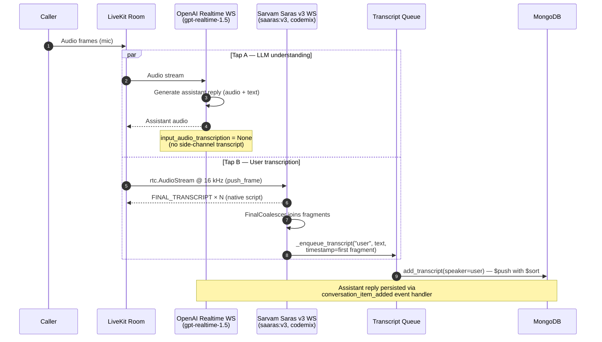

# Runtime Modes & Startup

How the API process boots, which background services it owns, and the three speech-generation paths an assistant can take at runtime.

## API Startup Services

When the FastAPI app starts, it initializes MongoDB and conditionally starts two long-running background services:

- **Exotel inbound SIP listener** — listens for incoming SIP INVITE/BYE from Exotel on boot (controlled by `ENABLE_SIP_LISTENER` env var, default `true`)
- **Outbound call dispatcher** — event-driven loop that drains the outbound call queue (controlled by `ENABLE_DISPATCHER` env var, default `true`)

In **single-container / dev** mode both services run inside the API process. In **production Docker** deployments a dedicated `sip_dispatcher` container runs `sip_dispatcher_run.py`, which owns both services exclusively. The `api` container sets `ENABLE_SIP_LISTENER=false` and `ENABLE_DISPATCHER=false` so it can scale to multiple Gunicorn workers without SIP port conflicts or duplicate dispatchers.

Outbound request acceptance and outbound call execution are fully decoupled. The API enqueues calls and returns immediately; the dispatcher handles pacing and retry independently.

### Two-Server Deployment Roles

For horizontal scaling without Kubernetes, run containers by role:

- **Server A (control plane):** `api` + `sip_dispatcher`
- **Server B (capacity node):** `agent`
- Optional: run extra `agent` on Server A if CPU headroom exists

The project `docker-compose.yml` uses service profiles:

- `control` profile: `api`, `sip_dispatcher`
- `agent` profile: `agent`

Dockerfile mode mapping:

- `control` deploys use `docker/Dockerfile.control`
- `agent` deploys use `docker/Dockerfile.agent`
- `full` deploys force all services to use the original `Dockerfile`

The `agent` container launches the worker with `python -m livekit.agents start agent_run.py`.
`agent_run.py` builds the `AgentServer` from `WorkerOptions`; the SDK's CLI imports that file
and looks for a module-level `AgentServer` named `server`. Locally the equivalent is
`uv run agent_run.py dev`, which still goes through the SDK's deprecated Python CLI and says so
in a warning.

Commands:

```bash
# Server A
docker compose --profile control up -d --build

# Server B
docker compose --profile agent up -d --build

# Single host full stack (original Dockerfile)
./deploy.sh full
```

Critical singleton rule: only one `sip_dispatcher` instance should run across all servers.

## Assistant Runtime Modes

Speech generation has **two orthogonal axes**:

1. **Mode** (`assistant_mode`) = how many models are in the loop:
   - `pipeline` (**half**-cascade, the default): a *realtime* model emits **text**, an external TTS plugin speaks it. User transcription is a side channel — a parallel Sarvam tap, or the realtime model transcribing itself.
   - `realtime`: one model does STT + LLM + TTS and speaks its own **audio** (no external TTS).
   - `cascade`: a **true three-stage pipeline** — a plugin STT, a plain (non-realtime) LLM, and a plugin TTS, each a separate stage that is separately metered and independently swappable. See [Cascade Pipeline](cascade-pipeline.md).
2. **Provider** (`assistant_llm_config.provider`) = LLM vendor: `openai` | `gemini`. Defaults to `gemini` in `realtime` mode and `openai` in the other two. **`gemini` is accepted in `realtime` mode only**; `pipeline` and `cascade` are OpenAI-only and reject it with a `422`.

The matrix:

| Mode | provider `openai` | provider `gemini` |
|---|---|---|
| `pipeline` (text + external TTS) | OpenAI `gpt-realtime-1.5` (text out) -> external TTS | **not supported** — rejected at create/update |
| `realtime` (model speaks audio) | OpenAI realtime (audio out) | Gemini realtime (STT+LLM+TTS) |
| `cascade` (true pipeline) | plugin STT -> `openai.responses.LLM` -> plugin TTS | **not supported** — rejected at create/update |

**Why Gemini is not available in `pipeline` mode.** Half-cascade needs the realtime model in a
text-only response modality so an external TTS can speak the result. Google's Live API supports that
only on non-native-audio models ([googleapis/python-genai#1780](https://github.com/googleapis/python-genai/issues/1780)),
and the Live models this platform targets are native-audio; the 3.1 line additionally ignores
`generate_reply()` and `update_instructions()`, which the greeting and handoff paths depend on. The
combination used to be accepted and then misbehaved at call time — it is now a `422`. Full table:
[Compatibility Matrix](../reference/compatibility.md).

Which to pick:

| Want | Mode |
|---|---|
| Lowest latency, one vendor, don't need cost breakdown | `realtime` |
| Realtime understanding but a specific TTS voice | `pipeline` |
| Per-component cost visibility, cheap text models, swappable STT | `cascade` |

In `pipeline` mode, user transcription runs **in parallel** via Sarvam Saras v3 by default — see [Sarvam Parallel STT](#sarvam-parallel-user-transcription) below; if Sarvam is disabled the LLM's own transcription tap is used instead. `cascade` does not use the tap at all: its STT *is* the session's first stage.

All modes share the same room orchestration, call lifecycle, transcript flow, and tool execution framework.
All modes also support assistant-first openings when `speaks_first=true`, using `assistant_start_instruction` as the opening response text.

## Latency & Cost Reduction

Two techniques reduce latency and token cost in `pipeline` mode with OpenAI Realtime STT/LLM.

### LLM Context Truncation

**Problem.** The OpenAI Realtime API accumulates the full conversation history in a `RemoteChatContext` on its server-side session. By default there is no cap — a 2-minute call can accumulate 55,000+ tokens. This drives up both cost (billed per token) and TTFT (the model must attend to a longer context every turn).

**Solution.** `RealtimeTruncationRetentionRatio` (OpenAI Realtime API parameter) is configured on every `RealtimeModel` session:

```python
truncation=RealtimeTruncationRetentionRatio(
    type="retention_ratio",
    retention_ratio=0.75,
    token_limits=TokenLimits(post_instructions=8000),
)
```

- `post_instructions=8000` — hard cap on context tokens *after* the system prompt.
- `retention_ratio=0.75` — when the cap is hit, the model retains the most recent 75% of turns and discards the oldest 25%.

**Observed impact.** Token count dropped from ~55,000 to ~7,300 on a 2-minute call — an 87% reduction.

**Not sent to every model.** `session.truncation` is a GA Realtime API field, and the two
`gpt-4o-*realtime-preview` models on the allowlist predate it — their session shape has no
such field, and the Realtime API answers an unknown session field with an error event rather
than ignoring it. `realtime_supports_truncation` (`src/core/model_support/capabilities.py`)
decides per model; a preview model runs without the cap and logs one line saying so. Use a
`gpt-realtime*` model to get the reduction above. Semantic VAD predates the split and is sent
to both generations.

### Sarvam TTS WebSocket Keepalive

**Problem.** Sarvam TTS uses a WebSocket connection pool (`ConnectionPool`, `max_session_duration=3600`). However, the Sarvam server closes idle TCP connections after ~5 seconds of inactivity. Without intervention, every turn that has a gap longer than 5 seconds triggers a full TCP reconnect and Sarvam session handshake before audio synthesis can start — adding 300–800 ms of latency before the first audio frame.

**Solution.** `maintain_sarvam_connection` is spawned as a call-lifetime background task immediately after the participant joins (Sarvam assistants only):

```python
if isinstance(tts, sarvam_plugin.TTS):
    asyncio.create_task(maintain_sarvam_connection(tts, _sarvam_stop))
```

The function (`src/core/agents/tts/factory.py`):

1. Forces a fresh TCP connection at call start (`tts._pool.invalidate()` + `get()`).
2. Enters a loop that wakes every 3 seconds:
   - **Skips ping** if `current_ws not in tts._pool._available` — TTS is actively using the connection and must not be interrupted.
   - **Sends a WebSocket ping** to reset the server-side idle timer.
   - **Reconnects** if the server has already closed the connection (`current_ws.closed` or ping failure).
3. Exits cleanly when `_sarvam_stop` event is set at call teardown.

**Observed impact.** The reconnect log line now appears once at call start instead of between every turn.

## Sarvam Parallel User Transcription

**Problem.** In OpenAI pipeline mode (`assistant_mode="pipeline"`, `provider="openai"`) with `assistant_stt_model="native"`, the `input_audio_transcription` side channel uses an OpenAI transcription model (`gpt-4o-mini-transcribe`). On Indic mixed / code-switched speech (Hindi-English-Tamil-Urdu in one call) this model:

- Switches scripts mid-utterance (Devanagari → Tamil → Arabic → Spanish)
- Romanises words instead of using the speaker's native script
- Hallucinates entire phrases on noisy phone audio

Direct fix by swapping the transcription model is **not possible** — `input_audio_transcription.model` is a closed whitelist controlled server-side by OpenAI (`whisper-1`, `gpt-4o-transcribe`, `gpt-4o-mini-transcribe`, `gpt-4o-transcribe-diarize`). The field accepts no URL, callback, or third-party endpoint.

**Solution.** Run **Sarvam Saras v3** (`saaras:v3`, `codemix` mode, `language="unknown"` by default) as a parallel audio tap from the LiveKit room. Sarvam is trained on Indic + code-switched speech and outputs each word in its correct native script. The OpenAI Realtime LLM continues to consume the audio directly for understanding and reply generation — only the persisted user transcript is overridden.

Selected per assistant via `assistant_stt_model`, configured via `assistant_stt_config` — the same model-plus-config shape TTS uses. `src/core/agents/stt/factory.py::resolve_stt` resolves the pair; unset means `sarvam`.

| Value | Effect |
|-------|--------|
| `sarvam` (default) | Sarvam parallel tap writes user transcripts. The LLM's own transcription is disabled (`None`). Config: `model`, `language`, `mode`, `api_key`. |
| `native` | The conversational LLM writes user transcripts itself (OpenAI `gpt-4o-mini-transcribe`). No Sarvam tap, no config fields. |
| `cartesia` | **`cascade` mode only.** Rejected in `pipeline` mode — there is no Cartesia tap. |
| `deepgram` | **`cascade` mode only.** Rejected in `pipeline` mode — there is no Deepgram tap. |
| `elevenlabs` | **`cascade` mode only.** Rejected in `pipeline` mode — there is no ElevenLabs tap. |

**Degrade rule.** `cartesia`/`deepgram`/`elevenlabs` are cascade-only: on a `pipeline` assistant the selection does **not** change transcription — `resolve_stt` ignores it, logs a warning, and the conversational LLM self-transcribes (`native` path) instead. Their settings are meaningful only in `cascade` mode. Similarly, wherever a plugin provider is selected but no key is available (neither config `api_key` nor a matching system `*_API_KEY`), `resolve_stt` logs a warning and degrades to `native` rather than starting a session that cannot authenticate.

In `cascade` mode the same two fields select the session's own STT **stage** instead of a tap, and are resolved by `create_stt` rather than `resolve_stt`. `native` is rejected there: it means "the realtime model transcribes itself", and cascade has no realtime model. See [Cascade Pipeline](cascade-pipeline.md).

**API key.** The tap authenticates with `assistant_stt_config.api_key`, falling back to the system `SARVAM_API_KEY`. It deliberately does **not** read `assistant_tts_config["api_key"]`: that field is scoped to the selected TTS provider, so on a Cartesia/ElevenLabs/Mistral assistant it holds a foreign key and Sarvam answers `403 Invalid response status`. Because the tap also disables the LLM's own transcription, an auth failure there means the call runs with **no user transcripts at all** — so keep the two keys separate. When neither key is present, `resolve_stt` logs a warning and degrades the call to `native` rather than starting a tap that cannot authenticate.

**Migration.** These two fields used to live inside `assistant_interaction_config` (`user_stt_provider`, `stt_api_key`). `scripts/migrate_stt_config.py` moves them; the retired keys are now rejected with `422`.

**Data flow per utterance:**



**Implementation details:**

- Module: `src/core/agents/stt/sarvam_parallel.py` — `run_sarvam_parallel_stt(...)` coroutine.
- Spawned once after `wait_for_participant()` returns, scoped to the caller's identity. Late-binds if the audio track was already published. The task handle is kept (`_sarvam_task`) so teardown can tell the two STT paths apart, and so a crash inside the tap is not swallowed.
- Stop signal: re-uses the existing `_sarvam_stop = asyncio.Event()` that already gates the Sarvam TTS keepalive — both exit on the same teardown.
- Frame pump: `rtc.AudioStream(track, sample_rate=16000, num_channels=1)` upsamples 8 kHz G.711 phone audio in-process; frames pushed via `stream.push_frame(frame)`.
- Usage: the pump also sums each frame's duration into the `SttUsage` tally it was handed, which teardown turns into the call's `stt_usage` entry. The tap's plugin STT never reaches the `AgentSession`, so this is the only place the seconds can be counted — see [Usage accounting](../reference/usage-accounting.md).
- Duplicate-write guard: `conversation_item_added` short-circuits when `event.item.role == "user" and _use_sarvam_stt`, so OpenAI's empty / stale user item never reaches the DB.
- Shared transcript helper: `_enqueue_transcript(speaker, text, timestamp=None)` queues the DB write — used by both the Sarvam callback and the OpenAI assistant-role path. Single source of truth for the `add_transcript` call shape.
- Silence watchdog: the coalescer's emit callback calls `silence_watchdog.on_user_message()` to reset the reprompt timer, preserving parity with the OpenAI-only path.

**Fragment coalescing.** `SpeechGate` zeroes non-speech audio after a 600 ms hangover (`_HANGOVER_MS`), so any longer intra-sentence pause reaches Sarvam as digital silence, its server VAD endpoints, and one sentence comes back as several `FINAL_TRANSCRIPT` events. Writing each as its own row produced visibly half-finished transcript lines, and gave `language="unknown"` auto-detect a scrap of audio per decision — which is why the script could flip mid-utterance.

`FinalCoalescer` (same module) buffers fragments and emits one joined utterance after `MERGE_WINDOW_S` (1.0 s) of quiet, or immediately when `flush()` is called. `flush()` is driven from two places: `agent_state_changed → speaking` (the agent talking means the user's turn is over) and teardown. A pause longer than the window still splits — raise `MERGE_WINDOW_S` or add flush triggers if callers report split lines.

**One coalescer, both STT paths.** `_user_coalescer` is built once in `session.py`, before the session handlers are registered, and is not Sarvam-specific: the tap feeds it via `run_sarvam_parallel_stt(coalescer=...)`, and on the `native` path `conversation_item_added` feeds it directly for `role == "user"`. The same endpointing problem produces the same fragments on both. Text-only chats skip it entirely — there is no endpointing to undo, and a debounce would wrongly merge two separately typed messages.

The upstream cause is documented in [Input Speech Gate](audio-pipeline.md#input-speech-gate): `SpeechGate` used to be applied twice per frame on the session's audio input, halving the effective hangover to 300 ms, so *both* the Sarvam server VAD and the LLM's own VAD endpointed sooner than intended. That is fixed at the source; the coalescer remains as the backstop for genuine long pauses.

**End-of-call drain.** `call_end_triggered` and `_transcripts_closed` are deliberately separate flags. The first flips the instant a hangup is seen and guards against duplicate teardown; the second closes the transcript queue and flips only after the active STT has handed over the caller's last utterance. On any voice call `_flush_and_end_call` asks the active STT to finalize, then holds the transcript path open for one fixed `END_OF_CALL_GRACE_S` (4 s) window before flushing the coalescer and closing the queue. Both paths feed the same `_user_coalescer`, so that single flush covers whichever produced text — and the usage record and end-of-call webhook are delayed by the same 4 s.

| Path | How the tail is recovered |
|---|---|
| `sarvam` | The tap feeds Sarvam `DRAIN_SILENCE_S` (2 s) of digital silence *before* `end_input()`. Silence is what makes the tail come back: Sarvam only returns a segment once its server VAD endpoints, and the plugin forwards the resulting flush from inside its send loop — i.e. only when the next frame arrives. At hangup the frames stop, so without synthetic silence that flush is never sent and the segment stays stuck server-side. `end_input()` cannot rescue it either: the plugin sends `end_of_stream` and cancels its own reader in the same event-loop turn, discarding the reply. Same technique the SDK uses on its own STT (`agents/voice/audio_recognition.py::commit_user_turn`). |
| `native`, OpenAI | `session.commit_user_turn(skip_reply=True)` sends `input_audio_buffer.commit`, so the model transcribes its pending audio and fires one more `conversation_item_added`. `skip_reply` stops it answering a caller who has already hung up. The returned future is deliberately **not** awaited — in realtime mode there is no separate STT object, so it resolves immediately and awaiting it yields no grace at all; the 4 s window is the grace. |
| `native`, Gemini | **Not recoverable.** The plugin logs `commit_audio` as unsupported, and a user transcript is only marked final on `server_content.turn_complete`, which a mid-turn hangup never reaches. No amount of grace time helps; this is an API limitation, not a bug in this repo. |
| `cascade` | `session.commit_user_turn(skip_reply=True)` again — but here the session owns a real `stt=` stage, so the returned future resolves when that STT actually flushes. It **is** awaited, capped at the same 4 s. A cascade call therefore hangs up as soon as the tail lands instead of always waiting the full window. |
| text-only | Nothing to drain — no audio, no endpointing. |

**Ordering.** Transcript timestamps are stamped at capture, not at DB-write time, and the coalescer reports the arrival of the *first* fragment in a group. Agent text is produced locally and written almost immediately; user text costs a Sarvam round-trip plus the merge window, so it frequently reaches Mongo after the reply it triggered. `add_transcript` therefore appends with `{"$push": {"transcripts": {"$each": [entry], "$sort": {"timestamp": 1}}}}`, which slots each entry into speaking order on insert. Being an atomic update it also removes a read-modify-`save()` that could clobber transcripts when `update_call_status` / `end_call` / the dispatcher safety net wrote the same document concurrently. No read-side sorting is needed anywhere.

**Scope of fix.** Only the persisted user transcript is corrected. The OpenAI Realtime LLM still consumes raw audio embeddings — if the LLM itself misunderstands Indic input, the assistant reply will reflect that. To fix LLM *understanding* as well, switch the assistant to [`cascade`](cascade-pipeline.md) mode, where the Sarvam transcript is the only thing the LLM ever sees, or to `realtime` + `gemini`.

## Native Transcription

When `assistant_stt_model="native"` — and always in full realtime mode, where the Sarvam tap never runs — the conversational LLM transcribes the caller itself and the text arrives through `conversation_item_added`.

**Prompt and noise reduction.** `src/core/agents/stt/native_prompt.py` builds the transcription prompt (`build_native_stt_prompt`) and picks the noise-reduction model (`noise_reduction_for`: `far_field` on phone calls, whose model is trained on lossy G.711; `near_field` on web). The prompt carries `interaction_config.preferred_languages` as a hint plus the literal-transcription rules — native script, no romanization, no translation, `[inaudible]` rather than a guess. Both feed every OpenAI branch, half-cascade and full realtime alike. Full realtime previously passed neither and ran on the `gpt-4o-mini-transcribe` default with no instructions and no phone tuning.

**Usage.** The Realtime API bills this ASR on its own pricing, separately from the realtime model, and reports the tokens on every `conversation.item.input_audio_transcription.completed` event — which the LiveKit plugin's handler drops. `src/core/agents/stt/native_usage.py` reads them off the plugin's public raw event stream (`openai_server_event_received`) and hands them to `summarize_usage`, so a `realtime` or native-`pipeline` call records `stt_provider="openai"` with real token counts instead of a zero. Gemini reports none, and none is missing: its input audio is already inside the LLM prompt tokens. See [Usage accounting](../reference/usage-accounting.md).

**Model choice.** Both branches use `gpt-4o-mini-transcribe` (`NATIVE_TRANSCRIBE_MODEL`, defined beside the tally so the two cannot drift). The Indic failures above came from an unprompted, un-tuned side channel, not from model size, and mini accepts the prompt and `far_field` just as `gpt-4o-transcribe` does — so the fix carries no per-minute cost increase. Upgrading the model is a one-word change in `src/core/agents/stt/native_usage.py`, worth making only against a measured accuracy comparison.

**Language is never pinned.** `AudioTranscription.language` is deliberately left unset so a caller who switches language mid-call is still transcribed correctly — matching the Sarvam tap's `language="unknown"` default. `preferred_languages` steers the model; it does not constrain it.

**Gemini caveat.** `genai_types.AudioTranscriptionConfig()` takes no arguments, so none of the prompt applies on a Gemini assistant — it transcribes on its own defaults. Gemini also cannot recover the last utterance before a hangup; see the end-of-call drain table above.

**Hold and the readiness gate do not suppress the caller.** `should_record(role, on_hold, gate_active)` in `session.py` decides what reaches the transcript. Both conditions exist to keep the *agent* quiet and out of the record, so they apply to assistant items only. `CallReadinessGate.is_active` flips on a single `call_answered` SIP data packet, so gating user speech on it meant one dropped or malformed packet discarded every transcript for the whole call, silently, while the conversation carried on normally. The Sarvam callback never consulted either check, so this also makes the two paths behave identically. Trade-off: pre-answer ring audio and on-hold speech can now be stored if the model transcribes any. Pinned by `tests/test_should_record.py`. The listener that flips `CallReadinessGate` is now registered before `session.start()` runs (previously after), so the one `call_answered` packet this gate depends on can no longer arrive and be missed while the agent is still booting.
