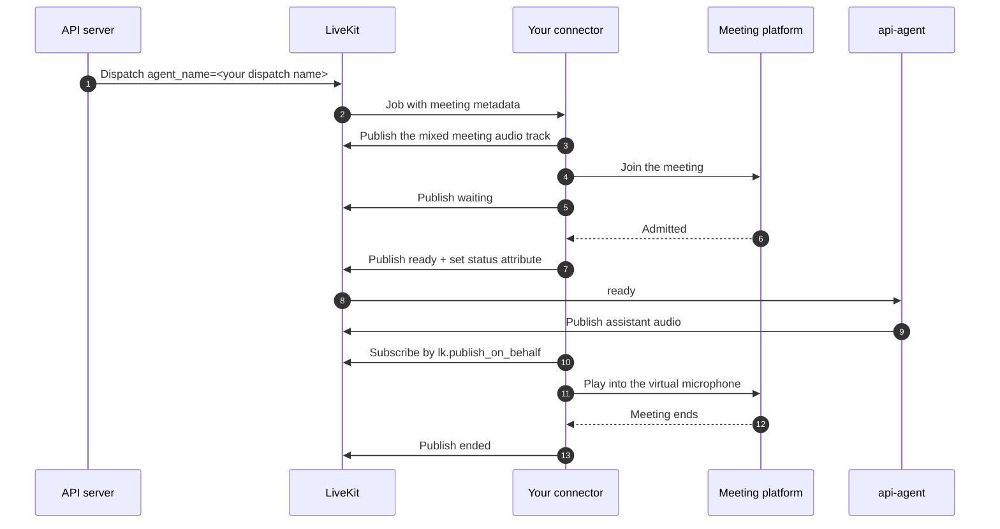

# Build a Meeting Connector

A **meeting connector** is a worker that puts this platform's assistant into a third-party meeting.
It joins the meeting as a participant, carries the meeting's audio into a LiveKit room, and carries
the assistant's audio back out.

This repository ships no connector. It dispatches one and owns everything about the call except the
browser. Google Meet support is provided by a separate worker registered under the dispatch name
`meet-connector`; this guide documents the contract that worker implements, so you can modify it or
write another one for Zoom, Teams, Webex, or anything else with a web client.

Read [Google Meet call architecture](../architecture/meeting-calls.md) first if you have not. This
guide assumes you know that a meeting call is two LiveKit jobs in one room.

!!! info "Where the connector source lives"
    Citations prefixed `connector:` in this guide refer to the Google Meet connector repository,
    which is deployed separately from this one. Paths without a prefix are in this repository.

## The contract

A connector is an ordinary LiveKit agent worker. Everything below is what makes it a *connector*
rather than an assistant.



### 1. Register under a dispatch name

The API dispatches the connector explicitly, by name. That name comes from
`MEETING_CONNECTOR_AGENT_NAME` (default `meet-connector`, `src/core/config.py`), so your worker's
`agent_name` and that environment variable have to agree. Nothing else routes the job.

```python
server = AgentServer.from_server_options(
    WorkerOptions(
        entrypoint_fnc=entrypoint,
        agent_name="meet-connector",
        num_idle_processes=0,
        load_fnc=_worker_load,
        load_threshold=1.0,
    )
)
```
— `connector:agent_run.py`

Two details that matter more than they look:

- **Cap concurrency yourself.** A connector runs a real browser, so its ceiling is nothing like an
  assistant's. The Google Meet connector reports `len(active_jobs) / max_concurrent_jobs` as its
  load with a threshold of `1.0`, which means one browser per worker by default. This is separate
  from `MAX_CONCURRENT_MEETING_CALLS` in this repository, which is the *business* cap on how many
  meeting calls the deployment accepts.
- **`num_idle_processes=0`.** Prewarming a browser you may never use is expensive, and a meeting
  call can tolerate the fork.

### 2. Read the job metadata

The API sends the connector a JSON object with four keys:

| Key | Value |
|---|---|
| `call_type` | Always `"meeting"`. |
| `platform` | The meeting platform, e.g. `"google_meet"`. |
| `meeting_url` | The URL the bot should join. |
| `bot_display_name` | The name to show in the meeting. Falls back to the assistant's name, then `"Assistant"`. |

!!! warning "The assistant and the connector receive different key names"
    The same platform value is sent to the assistant as `meeting_platform` and to the connector as
    `platform`, and the caller's own `metadata` is forwarded only to the assistant. Read `platform`
    in a connector; do not assume the two payloads are the same object.

Validate all of it and fail loudly. The Google Meet connector rejects a `call_type` that is not
`meeting`, a `platform` it does not implement, and a `meeting_url` whose scheme or host is wrong
(`connector:src/standalone_google_meet/config.py`). A connector that starts a browser before
checking the URL has already spent the expensive resource.

The room name is **not** in the metadata. Take it from `ctx.room.name`.

### 3. Publish one mixed meeting audio track

Publish exactly one audio track carrying every meeting participant, mixed. Not one track per
speaker.

```python
source = rtc.AudioSource(sample_rate, 1)
track = rtc.LocalAudioTrack.create_audio_track("meet-audio-mixed", source)
await ctx.room.local_participant.publish_track(
    track, rtc.TrackPublishOptions(source=rtc.TrackSource.SOURCE_MICROPHONE)
)
```
— `connector:src/standalone_google_meet/livekit/audio_sync.py`

One mixed track matches the assistant's one-linked-participant model, so it hears everyone. The
cost is that transcripts cannot attribute a sentence to a named meeting participant. That trade-off
is deliberate and is documented for API users in
[Join a Meeting](../api/calls/meeting-call.md).

Publish this track **before** you start the browser. The assistant is already in the room waiting,
and a track that appears late is one more thing that can go wrong while a human is watching a
silent bot.

### 4. Subscribe to the assistant, and mix what you get

The assistant sets `lk.publish_on_behalf = <room name>` on its own participant before it starts its
session. Match on that attribute, not on an identity — LiveKit mints the agent's identity inside
the job token and nobody can know it in advance.

Then sum **every** audio track that participant publishes into one output:

```js
mixAudioTrack(mediaTrack) {
  if (!this.audioContext) {
    this.audioContext = new AudioContext();
    this.audioDestination = this.audioContext.createMediaStreamDestination();
    const mixedTrack = this.audioDestination.stream.getAudioTracks()[0];
    this.stream.addTrack(mixedTrack);
  }
  const source = this.audioContext.createMediaStreamSource(new MediaStream([mediaTrack]));
  source.connect(this.audioDestination);
}
```
— `connector:src/standalone_google_meet/browser/assets/livekit-client-adapter.js`

!!! danger "The two rules that decide whether the meeting hears anything"
    **Subscribe visibly.** LiveKit does not notify a publisher when a *hidden* participant
    subscribes. The agents SDK waits for that notification before forwarding a single audio frame,
    so a hidden subscriber leaves the assistant silent in the meeting *and* in the recording, with
    no transcript, while the model runs and bills normally. Grant `canSubscribe` without `hidden`.

    **Mix, never pick.** The assistant publishes speech and background audio as separate tracks. A
    consumer that keeps one audio track per kind drops the other, last-one-wins. Background audio
    starts after the greeting, so the symptom is a meeting that hears ambience and never the
    assistant.

    Both failures are silent on the connector side. Neither produces an error anywhere.

### 5. Emit the lifecycle events

The assistant will not speak until the connector says it is ready, and it will give up on
deadlines. Publish JSON on the `meeting_connector_events` data topic, reliably:

```json
{"event": "waiting", "detail": "waiting for admission"}
{"event": "ready"}
{"event": "failed", "detail": "browser could not join meeting"}
{"event": "ended", "detail": "meeting ended"}
```

| Event | Emit it when | What the assistant does |
|---|---|---|
| `waiting` | The bot is in the meeting's waiting room. | Records it. Informational. |
| `ready` | The bot is admitted **and** the meeting can already hear whatever the assistant publishes. | Moves the call to `answered`, starts the recording, and greets. |
| `failed` | The join failed, for any reason. | Fails the call with your `detail` as the reason. |
| `ended` | The meeting ended, the bot was removed, or the worker is shutting down. | Finalizes the call. |

When you publish `ready`, also set `lk.meeting_connector_status = "ready"` on your participant.
LiveKit does not replay data packets to late subscribers, so an assistant that was still connecting
when the packet went out would otherwise never learn. The attribute is the recovery path.

Emit each event once. The assistant's handling is idempotent, but a connector that re-publishes
`ready` after `ended` is describing a lifecycle that cannot happen.

`ready` is also what starts the recording, so a connector that reports it late delays the recording
by the same amount — and a call that never reports it is never recorded.

!!! danger "`ready` means the meeting can hear you, not that you were admitted"
    **Emit `ready` only once your platform-side microphone is live.** The assistant greets within a
    second or two of receiving it. Anything it says before the microphone is on is lost to the
    meeting and to nobody else: the recording is an egress of the LiveKit room and the transcript is
    produced model-side, so neither of them observes the meeting. Both will contain a greeting that
    no participant heard. The operator sees a complete call with a normal opening turn, the
    attendees see a bot that joined and said nothing, and every artifact agrees with the operator.

    **Subscribing is not unmuting.** LiveKit fires no unmute event for a track that was already
    unmuted when you subscribed, so a connector that turns its microphone on from a mute-change
    handler alone never turns it on at all. Unmute when you wire the audio path up, and let the
    mute-change handler carry only the changes after that.

    **Do not wait for video before wiring up audio.** The assistant publishes one audio track and no
    video, on every call. A fixed wait for a video track before the audio path is connected is dead
    air on every meeting, and the greeting is what pays for it.

!!! warning "Your waiting-room budget must be shorter than the assistant's"
    The assistant fails a call that is not ready within `MEETING_CONNECTOR_READY_TIMEOUT_SECONDS`
    (default `360`). If your own waiting-room timeout is longer, the assistant gives up first and
    the call record says only "readiness timed out" instead of carrying the real reason your
    connector would have reported. Keep yours comfortably below it —
    `tests/test_meeting_calls.py::TestConnectorTimeoutContract` pins the relationship from this
    side.

### 6. End the job cleanly

The assistant deletes the LiveKit room when the call finishes. Treat that as the normal end of your
job: listen for the room disconnecting and shut the browser down. The room can go away
**mid-meeting** — the assistant hangs up when the participant says goodbye, after repeated silence,
or at its maximum call duration — so do not assume the room outlives the meeting. Shutdown
callbacks cannot wake a blocked loop, so the Google Meet connector pushes a sentinel onto the same
queue its lifecycle events use rather than relying on the callback alone.

"Shut the browser down" means two separate things: leave the meeting, then kill the process that
was in it. Here is the Google Meet connector's teardown, as one worked example — the order is the
part to copy, not the framework:

```python
def close(self):
    self.stop_requested.set()
    try:
        self.leave()
    finally:
        self._quit_driver()
        self.websocket_server.close()
        if self.display:
            self.display.stop()
```
— `connector:src/standalone_google_meet/chrome/session.py`

`leave()` clicks the platform's own "Leave call" control, so the meeting shows a participant who
left rather than one who vanished. Treat it as best-effort: the control is localised and gets
renamed, so a connector that only clicks it will one day not leave at all. `_quit_driver()` is
`driver.quit()`, and *that* is what actually removes the participant — which is why it sits in a
`finally` where a missing button cannot skip it. The WebSocket server and the virtual display come
last, after nothing needs them. Every step is safe to run when the browser never started, because
this same teardown covers a job that failed during the join.

**You get fifteen seconds.** When the room disconnects, the agents SDK waits that long for your
entrypoint to return, then **cancels** it, and only then runs the callbacks registered through
`ctx.add_shutdown_callback`. Every rule below follows from that order.

!!! danger "The three rules that decide whether the bot actually leaves"
    **Leaving the meeting is a separate action from losing the room.** If your page holds its own
    LiveKit subscriber connection, that connection dying only stops the assistant's audio — the
    page is still joined to the meeting. Something must actively leave the platform and close the
    browser.

    **Mark cleanup done on completion, not on entry.** Cleanup runs from both the entrypoint's
    `finally` and the shutdown callback, so it needs a guard against running twice. A guard set
    *before* the work means a cancelled first attempt permanently disarms the backstop that exists
    for exactly that case. Remember that `except Exception` does not catch
    `asyncio.CancelledError`.

    **Never publish to a room that is already gone.** `publish_data` on a deleted room has no
    deadline. A final `ended` published after the room disconnected spends the whole fifteen-second
    grace and forces the cancellation that skips your teardown. The assistant already knows the
    call is over — it deleted the room.

    All three fail silently. The call finalizes correctly on this side, the webhook arrives, the
    recording lands, and the bot stays in the meeting.

Two more sit outside that window — one bites before it, one after:

**A stop request during the join must abort the join, not fail it.** If your stop flag surfaces as
an ordinary exception inside a join-retry loop, the connector relaunches the browser *after*
cleanup has already run, and nothing owns the browser that comes back.

**Kill the browser yourself.** The agents SDK kills a stuck job with a signal to the job process
only — there is no process-group kill. A browser whose driver was never quit is reparented and
stays in the meeting indefinitely. A container restart policy does not rescue it: the container
never restarted, only the job did.

!!! tip "Add an alone-in-meeting timer"
    Meeting platforms report "the meeting has ended" minutes after everyone leaves, and the
    assistant is waiting on you the whole time. The Google Meet connector ends the call itself
    after 30 seconds alone, publishing `ended` with detail `alone_in_meeting`. Without it, a call
    where the human simply hangs up keeps a browser and a model session alive.

## What the connector must not do

There is exactly one owner for call accounting, and it is `api-agent`. A connector must not create
a `CallRecord`, write a `UsageRecord`, start its own recording, or send the end-call webhook. Two
jobs racing over one call's lifecycle produces call records that contradict themselves and
duplicate webhooks.

The connector owns its browser and nothing else.

## Building a connector for another platform

The Google Meet connector is roughly half platform-agnostic. The split is clean enough that a
second platform is a bounded piece of work rather than a rewrite.

| Reusable unchanged | Written per platform |
|---|---|
| The LiveKit layer: worker lifecycle, event publishing, the mixed-audio track and its browser token | Metadata validation — one line naming the platform, plus the URL shape |
| The browser transport: the local WebSocket server, its typed frame protocol, the script-injection payload builder | The join flow: navigating, filling in a display name, clicking join, detecting admission, detecting the meeting ending |
| The input layer: the virtual pointer and keyboard used to look like a human | The page script: capturing the platform's audio, reading its participant list, clicking its microphone and camera controls |
| The LiveKit-to-MediaStream adapter, including the mixer | |
| `BotOutputManager` — the virtual webcam and microphone Meet, Zoom and Teams all consume the same way | |

So a new platform needs three things: a page script, a join flow, and a line of validation.

### The two interfaces your page script must honour

Everything the browser needs is injected before the page loads, as a `window.initialData` object —
the meeting URL, the display name, the audio sample rate, and the LiveKit configuration including
the `publish_on_behalf` value to match on.

Everything it sends back goes over a local WebSocket using a typed binary frame: a four-byte
little-endian type header followed by the payload. Type `1` is JSON for events and diagnostics;
type `3` is raw float32 audio. Keep the audio path binary and the control path JSON.

### Traps a second implementation will otherwise rediscover

These are all things the Google Meet connector learned the hard way. None of them are Meet-specific.

**Pin the `AudioContext` sample rate.** Construct it with the same rate you publish to LiveKit. A
host running at 44.1 kHz against a 48 kHz track plays the meeting back several percent fast, which
sounds like a slightly hurried speaker and wrecks transcription.

**Capture audio tracks incrementally.** A snapshot of the participants taken at admission misses
everyone who joins afterwards, and they are inaudible to the assistant for the rest of the call.
Hook the platform's track creation instead.

**Remove the assistant's own audio from the capture mix.** The bot's virtual microphone output
comes back around as an inbound track on most platforms. Left in, the assistant transcribes and
answers itself.

**Give the meeting both a video and an audio track.** Platforms that consume a virtual webcam
generally want both kinds present. The Google Meet connector synthesises a black video track when
the assistant publishes none, which is also why its tile appears with the camera on rather than
showing initials.

**Instrument the output path.** When a meeting is silent, "the audio never reached Web Audio" and
"the audio reached Web Audio and died after the gain node" look identical from outside. Sampling
the peak level at both points, once a second, is the difference between a five-minute diagnosis and
a five-hour one.

## Verifying a connector

Run one real meeting call and read both logs.

On this side, the worker log for the room should show, in order:

```text
Session input mode | call_type=meeting
Announced agent to meeting connector via lk.publish_on_behalf=<room>
Meeting input track subscribed | participant=… | name=meet-audio-mixed
Meeting connector event received | event=ready
Agent audio track subscribed — assistant audio can reach the meeting
```

The last line is the one that proves the two rules in step 4 are satisfied. If it is missing, or
its warning appears instead, the meeting cannot hear the assistant no matter how healthy everything
else looks.

On the connector side, confirm that the mixed-audio level is non-zero while somebody is speaking,
and that the assistant's output level is non-zero while the assistant is speaking. A level that is
non-zero *between* the assistant's turns and zero *during* them means you are carrying background
audio and dropping speech — the mixing rule again.

Those checks prove the meeting can hear. None of them can see whether the bot leaves, so end the
call deliberately and watch the exit: say goodbye so the assistant's `end_call` tool fires, or let
the silence re-prompts run out. Two things must then happen — the bot disappears from the meeting's
own participant list within a few seconds, and no browser or driver process outlives the job. A bot
that goes quiet but stays in the list is the teardown failure from
[step 6](#6-end-the-job-cleanly), not an audio fault.

[Troubleshooting](../reference/troubleshooting.md#a-meeting-call-is-silent-but-tokens-are-still-billed)
has the full symptom table.
